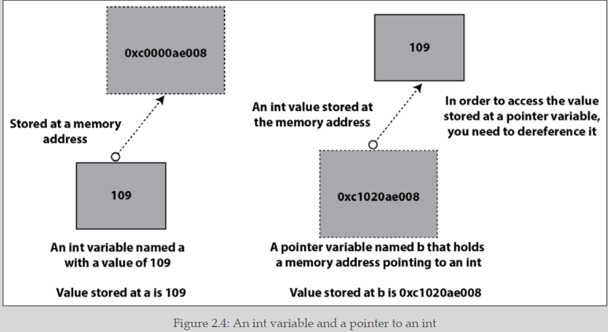

## A Quick Introduction to Go

### Introducing Go

- Go is an open-source systems programming language.
- public back in 2009.
- Robert Griesemer, Ken Thomson, and Rob Pike.
-  Go is a general-purpose programming language

**Go does better than other programming language :**

1. The default behavior of the Go compiler can catch a large set of silly errors that might result in bugs.
2. Go uses fewer parentheses than C, C++, or Java, and no semicolons, which makes the look of Go source code more human-readable and less errorprone.
3. Go comes with a rich and reliable standard library.
4. Go has support for concurrency out of the box through goroutines and channels.
5. Goroutines are really lightweight. You can easily run thousands of goroutines on any modern machine without any performance issues.
6. Unlike C, Go supports functional programming.
7. Go code is backward compatible, which means that newer versions of the Go
compiler accept programs that were created using a previous version of the
language without any modifications. This compatibility guarantee is limited
to major versions of Go. For example, there is no guarantee that a Go 1.x
program will compile with Go 2.x.

### The history of Go

- Go started as an internal Google project.
-  Go as a language for professional programmers who want to build .reliable, robust, and efficient software. 
- the Go compiler can find difficult to catch mistakes such as race
conditions.
  
### The advantages of Go

- Go has reserved only 25 keywords.
- concurrency capabilities using a simple concurrency model that
is implemented using goroutines and channel.
- Go manages OS threads for you
and has a powerful runtime that allows you to spawn lightweight units of work (goroutines) that communicate with each other using channels.
- Go's executable binaries are statically
linked, which means that once they are generated, they do not depend on any shared libraries and include all required information.
-  does not have strange side effects, and although Go supports pointers.
-  Go is not an object-oriented programming language, Go interfaces
are very versatile and allow you to mimic some of the capabilities of object-oriented languages such as polymorphism, encapsulation, and composition.
-  the latest Go versions offer support for generics, which simplifies your code when working with multiple data types.

**Although Go is a very practical and competent programming language, it is not perfect:**

-  Go has no direct support for object-oriented programming,
which is a popular programming paradigm.
- Although goroutines are lightweight, they are not as powerful as OS threads.
- Go will not allow you to perform any memory management manually

### The go doc and godoc utilities

- `go doc fmt.Printf`
- `go doc fmt`

- `go install golang.org/x/tools/cmd/godoc@latest`
-  `godoc -http=:8001`

###  Introducing functions

there is a global Go rule that also applies to function and variable names and is valid for all packages except main:
**everything that begins with a lowercase letter is considered private and is accessible in the current package only**

### Introducing packages

- Go programs are organized in packages—even the smallest Go program should be delivered as a package.

- if you are creating an executable application and not just a package that will be shared by other
applications or packages, you should name your package main

### Running Go code

- there are two ways to execute Go code:
as a compiled language using `go build` or as a scripting language using `go run`.

### Compiling Go codes

` go build -o helloWorld hw.go`

### Using Go like a scripting language

The go run command builds the named Go package, which in this case is the main package implemented in a single file, creates a       temporary executable file, executes
that file, and deletes it once it is done—to our eyes, this looks like using a scripting
language.

`go run hw.go`

### Defining and using variables

-  if no initial value is given to a variable,
the Go compiler will automatically initialize that variable to the zero value of its
data type.

-  The official name for := is short assignment statement.
-  the var keyword is mostly used for
declaring global or local variables without an initial value.
- every statement that exists outside of the code of a function must begin with a keyword such as func or var.
- the short assignment statement cannot be used outside of a function environment because it is not available there.
- Global variables can be accessed from anywhere in a
package without the need to explicitly pass them to a function and can be changed unless they were defined as constants using the const keyword.

### Controlling program flow

```go
// With expression after switch
switch argument {
case "0":
fmt.Println("Zero!")
fallthrough
default:
fmt.Println("Value:", argument)
}
```

```go
// No expression after switch
switch {
case value == 0:
fmt.Println("Zero!")
case value > 0:
fmt.Println("Positive integer")
case value < 0:
fmt.Println("Negative integer")
default:
fmt.Println("This should not happen:", value)
}
```

### Iterating with for loops and range

- depending on how you write a for loop, it can function as
a while loop or an infinite loop. Moreover, for loops can implement the functionality
of JavaScript's forEach function when combined with the range keyword.

-  for and range allow you to iterate over the elements
of a map in a similar way.

```go
// Traditional for loop
for i := 0; i < 10; i++ {
fmt.Print(i*i, " ")
}


// For loop used as while loop
i := 0
for {
if i == 10 {
break
}
fmt.Print(i*i, " ")
i++
}

// This is a slice but range also works with arrays
aSlice := []int{-1, 2, 1, -1, 2, -2}
for i, v := range aSlice {
fmt.Println("index:", i, "value: ", v)
}
```

### Reading from standard input

- `fmt.Scanln()`
-  read user input while the program is
already running and store it to a string variable, which is passed as a pointer to
fmt.Scanln().

### Working with command-line arguments

- command-line arguments
in Go are stored in the os.Args slice. Go also offers the flag package for parsing
command-line arguments, but there are better and more powerful alternatives.

```go
	arguments := os.Args
	var number float64
	for i := 1; i < len(arguments); i++ {

		n, err := strconv.ParseFloat(arguments[i], 64)
		if err != nil {
			continue
		}
		number = n
	}
```

### Understanding the Go concurrency model

- The Go concurrency model is implemented using goroutines and channels.
- A goroutine is the smallest executable Go entity.
- In order to create a new goroutine, you have to use
the go keyword followed by a predefined function or an anonymous function.
- A channel in Go is a mechanism that, among other things, allows goroutines to communicate and exchange data.
-  goroutines are do not share any variables, they can share memory.

### sDeveloping the which(1) utility in Go

- Go can work with your operating system through a set of packages.

```go
package main

import (
	"fmt"
	"os"
	"path/filepath"
)

func main() {
	arguments := os.Args
	if len(arguments) == 1 {
		fmt.Println("Please provide an argument!")
		return
	}
	file := arguments[1]
	path := os.Getenv("PATH")
	pathSplit := filepath.SplitList(path)
	for _, directory := range pathSplit {
		fullPath := filepath.Join(directory, file)
		// Does it exist?
		fileInfo, err := os.Stat(fullPath)
		if err == nil {
			mode := fileInfo.Mode()
			// Is it a regular file?
			if mode.IsRegular() {
				// Is it executable?
				if mode&0111 != 0 {
					fmt.Println(fullPath)
					return
				}
			}
		}
	}
}
```

### Logging information

- As we usually run our services via systemd, programs should log to stdout so systemd can put logging data in the journal.
- The UNIX logging service has support for two properties named logging level and logging facility
-  The logging level is a value that specifies the severity of the log entry. There are various logging levels, including debug, info, notice, warning, err, crit, alert, and emerg, in reverse order of severity
-  The log package of the standard Go library does not support working with logging levels.
- The logging facility is like
a category used for logging information. The value of the logging facility part can be
one of auth, authpriv, cron, daemon, kern, lpr, mail, mark, news, syslog, user, UUCP,
local0, local1, local2, local3, local4, local5, local6, or local7 and is defined
inside /etc/syslog.conf, /etc/rsyslog.conf, or another appropriate file.
-  if a logging facility is not defined correctly, it will not be handled.
-  The log package sends log messages to standard error.
-  Part of the log package is the
log/syslog package, which allows you to send log messages to the syslog server of your machine.
- **Logging is for application code, not library code. If you are developing libraries, do not put logging in them.**

- how to use the log and log/syslog packages to log messages to the system syslog on a Unix-like operating system :
```go
package main
import (
"log" //  This is the standard Go package for logging.
"log/syslog" // This package provides functionality to interact with the system's syslog facility.
)
func main() {
// LOG_SYSLOG :This specifies the facility for logging
sysLog, err := syslog.New(syslog.LOG_SYSLOG, "systemLog.go")
if err != nil {
log.Println(err)
return
} else {
log.SetOutput(sysLog)
log.Print("Everything is fine!")
}
}
```
### log.Fatal() and log.Panic()

- The log.Fatal() function is used when something erroneous has happened and you just want to exit your program as soon as possible after reporting that bad situation.
- The call to log.Fatal() terminates a Go program at the point where log.Fatal() was called after printing an error message.
-  it returns back a non-zero exit code, which in UNIX indicates an error.

- There are situations where a program is about to fail for good and you want to
have as much information about the failure as possible—log.Panic() implies that something really unexpected and unknown.
- log.Panic() prints a custom message and immediately
terminates the Go program.
- **log.Panic() is equivalent to a call to log.Print() + panic(). panic() > stops the execution of the current function and begins panicking. After that, it returns to the caller function**

- **log.Fatal() is equivalent to a call to log.Print() + os.Exit(1) immediate way of terminating the current program**

### Overview of Go generics

- Go supports multiple data types in functions such as fmt.Println()
using the empty interface and reflection.
- generics comes into play for providing an alternative to the use
of interfaces and reflection for supporting multiple data types. 
```go
package main
import (
"fmt"
)
func Print[T any](s []T) {
for _, v := range s {
fmt.Print(v, " ")
}
fmt.Println()
}
func main() {
Ints := []int{1, 2, 3}
Strings := []string{"One", "Two", "Three"}
Print(Ints)
Print(Strings)
}
```

-  I believe that generics should be used when they can create simpler code and
designs. It is better to have repetitive straightforward code than optimal abstractions that slow down your applications.

---

## Basic Go Data Types

### The error data type

- Go provides a special data type for representing error conditions and error messages named error.
- this means that Go treats errors as values.
- if the value of an error variable is nil, then there was no error
- if you want to create your own error messages, you can use `errors.New()` from the errors package.
- This usually happens inside a function other than main()
because main() does not return anything to any other function. 
- You will most likely work with errors in your programs without
needing the functionality of the errors package. Additionally,
you do not need to define custom error messages unless you are
creating big applications or packages.
- If you want to format your error messages in the way `fmt.Printf()` works, you can use the `fmt.Errorf()` function, which simplifies the creation of custom error messages—the `fmt.Errorf()` function returns an error value just like `errors.New()`.

```go

package main
import (
"errors"
"fmt"
"os"
"strconv"
)

return errors.New("this is a custom error message")

return fmt.Errorf("a %d and b %d. UserID: %d", a, b, os.Getuid())
```

**you should have a global error handling tactic in each application that should not change. In practice, this means the following:**

- All error messages should be handled at the same level, which means that
all errors should either be returned to the calling function or be handled at the place they occurred.
- It is considered a good practice to send all error messages to the log service of your machine

### Numeric data types

| Data Type  | Description                       |
| ---------- | --------------------------------- |
| int8       | 8-bit signed integer              |
| int16      | 16-bit signed integer             |
| int32      | 32-bit signed integer             |
| int64      | 64-bit signed integer             |
| int        | 32- or 64-bit signed integer      |
| uint8      | 8-bit unsigned integer            |
| uint16     | 16-bit unsigned integer           |
| uint32     | 32-bit unsigned integer           |
| uint64     | 64-bit unsigned integer           |
| uint       | 32- or 64-bit unsigned integer    |
| float32    | 32-bit floating-point number      |
| float64    | 64-bit floating-point number      |
| complex64  | Complex number with float32 parts |
| Complex128 | Complex number with float64 parts |

- The int and uint data types are special as they are the most efficient sizes for signed
and unsigned integers on a given platform and can be either 32 or 64 bits each—their size is defined by Go itself. 

### Non-numeric data types

- Go has support for Strings, Characters, Runes, Dates, and Times. 
-For Go, dates and times are the same thing and are represented by
the same data type.

#### Strings, Characters, and Runes:

- A Go string is just a collection of bytes and can be accessed as a whole or as an array.

- ASCII: ASCII is a 7-bit encoding system, which means it uses 7 bits (128 possible values) to represent characters. It was originally designed for encoding basic English characters, control characters (e.g., carriage return, line feed), and some common symbols.
- A single byte can store any ASCII character.
  
- Unicode: Unicode, on the other hand, is a much more comprehensive character encoding system. It uses 16 bits (65536 possible values) to represent characters, allowing it to encompass a vast range of characters from various scripts and languages around the world.

- multiple bytes are usually needed for storing a single Unicode character.

- Go is designed with Unicode support in mind. which is the main reason for having the rune data type.
  
- A rune is an int32 value that is used for representing a single
Unicode code point.

- Although a rune is an int32 value, you cannot compare a rune
with an int32 value. Go considers these two data types as totally
different.

- You can create a new byte slice from a given string by using a []byte("A String") statement. ( byte slices that contain Unicode characters).
- You can define a rune using single quotes: `r := '€' `and you can print the integer value of the bytes that compose it as `fmt.Println(r)`
- Printing it as a single Unicode character requires the use of the `%c` control string in `fmt.Printf()`.
- The length of the string is the same as the number of characters found in the string,which is usually not true for byte slices because Unicode characters usually require more than one byte.
  

```go

package main

import "fmt"

func main() {

    // a string literal that contains a Unicode character
	aString := "Hello World! €"
	fmt.Println("First character", aString[0])         
	fmt.Println("First character", string(aString[0])) 

	// A rune
	r := '€'
	fmt.Println("As an int32 value:", r)
	// Convert Runes to text
	fmt.Printf("As a string: %s and as a character: %c\n", r, r)

	// Print an existing string as runes
	for _, v := range aString {
		fmt.Printf("%x ", v)
	}
	fmt.Println()

	// Print an existing string as characters
	for _, v := range aString {
		fmt.Printf("%c", v)
	}
	fmt.Println()

}
```

#### Converting from int to string

1. using string()
2. using a function from the strconv package

**However, the two methods are fundamentally different. The `string()` function converts an integer value into a Unicode code point, which is a single character, whereas functions such as `strconv. FormatInt()` and `strconv.Itoa()` convert an integer value into a string value with the same representation and the same number of characters.**

```go
// n = 100
input := strconv.Itoa(n) // "100"
input = strconv.FormatInt(int64(n), 10) // "100"
input = string(n) // "d"
```

#### The unicode package

- The unicode standard Go package contains various handy functions for working with Unicode code points.
- `unicode.IsPrint()`, can help you to identify the parts of a string that are printable using runes.
- This utility is very handy for filtering your input or filtering data before printing it on screen, storing it in log files transferring it on a network, or storing it in a database.


```go
package main
import (
    "fmt"
    "log"
    "unicode"
)
func main() {
    dataToLog := "This is some log data with non-printable characters: \x07"
    if !unicode.IsPrint(dataToLog) {
        log.Fatal("Log data contains non-printable characters.")
    }
    log.Println(dataToLog)
}
```
#### The strings package
- If you are working with text and text processing, you definitely need to learn all the gory details and functions of the strings package
- https://github.com/mactsouk/mastering-Go-3rd/blob/main/ch02/useStrings.go
- https://pkg.go.dev/strings

### Times and dates
- The king of working with times and dates in Go is the `time.Time` data type, which represents an instant in time with *nanosecond precision*. Each `time.Time` value is associated with a **location (time zone)**.
- **when you want to parse a date or time string, you need to use a specific format string to match the structure of the input string. It mentions that if you have a date string like "30 January 2020," you should use the format "02 January 2006" to parse it correctly**
- The next table shows the most widely used strings for parsing dates and times:

| Parse Value | Meaning (examples)                   |
| ----------- | ------------------------------------ |
| 05          | 12-hour value (12pm, 07am)           |
| 15          | 24-hour value (23, 07)               |
| 04          | Minutes (55, 15)                     |
| 05          | Seconds (5, 23)                      |
| Mon         | Abbreviated day of week (Tue, Fri)   |
| Monday      | Day of week (Tuesday, Friday)        |
| 02          | Day of month (15, 31)                |
| 2006        | Year with 4 digits (2020, 2004)      |
| 06          | Year with the last 2 digits (20, 04) |
| Jan         | Abbreviated month name (Feb, Mar)    |
| January     | Full month name (July, August)       |
| MST         | Time zone (EST, UTC)                 |

```go
package main

import (
    "fmt"
    "time"
)

func main() {
    inputDate := "30 January 2020"
    format := "02 January 2006" // write this format from table above.
    parsedDate, err := time.Parse(format, inputDate)
    if err != nil {
        fmt.Println("Error:", err)
        return
    }
    fmt.Println("Parsed Date:", parsedDate.Format("02 January 2006"))
}
```

#### A utility for parsing dates and times

```go
package main
import (
"fmt"
"os"
"time"
)

// Is this a date only?
d, err := time.Parse("02 January 2006", dateString)
if err == nil {
fmt.Println("Full:", d)
fmt.Println("Time:", d.Day(), d.Month(), d.Year())

// Is this a date + time?
d, err = time.Parse("02 January 2006 15:04", dateString)
if err == nil {
fmt.Println("Full:", d)
fmt.Println("Date:", d.Day(), d.Month(), d.Year())
fmt.Println("Time:", d.Hour(), d.Minute())
}

// Is this a date + time with month represented as a number?
d, err = time.Parse("02-01-2006 15:04", dateString)
if err == nil {
fmt.Println("Full:", d)
fmt.Println("Date:", d.Day(), d.Month(), d.Year())
fmt.Println("Time:", d.Hour(), d.Minute())
}

// Is it time only?
d, err = time.Parse("15:04", dateString)
if err == nil {
fmt.Println("Full:", d)
fmt.Println("Time:", d.Hour(), d.Minute())
}
```
#### Working with different time zones

1.  you need time.Parse() in order to convert a valid input into a time.Time value before doing the conversions. This time the input string contains the time zone and is parsed by the *"02 January 2006 15:04 MST*" string.
2.  
```go
  package main

import (
	"fmt"
	"os"
	"time"
)

func main() {

	if len(os.Args) == 1 {
		fmt.Println("Need input in __02 January 2006 15:04 MST__ format!")
		return
	}

	input := os.Args[1]
	now, err := time.Parse("02 January 2006 15:04 MST", input)
	if err != nil {
		fmt.Println(err)
		return
	}

	// Local time
	loc, _ := time.LoadLocation("Local")
	fmt.Printf("Current Location: %s\n", now.In(loc))

	// NY
	loc, _ = time.LoadLocation("America/New_York")
	fmt.Printf("New York Time: %s\n", now.In(loc))

	// London
	loc, _ = time.LoadLocation("Europe/London")
	fmt.Printf("London Time: %s\n", now.In(loc))

	// Tokyo
	loc, _ = time.LoadLocation("Asia/Tokyo")
	fmt.Printf("Tokyo Time: %s\n", now.In(loc))
}
```

### Go constants

- Go supports constants, which are variables that cannot change their values.
- the value of a constant variable is defined at compile time, not at runtime—this means that it is included in the binary executable.
- Behind the scenes, Go uses Boolean, string, or number as the type for storing constant values because this gives Go more flexibility when dealing with constants.

#### The constant generator iota

- Although we are defining constants inside main(), constants can be normally found outside of main() or any other function or method.
- The constant generator iota is used for declaring a sequence of related values that use incrementing numbers without the need to explicitly type each one of them.

```go
const PI = 3.1415926
const (
C1 = "C1C1C1"
C2 = "C2C2C2"
C3 = "C3C3C3"
)


const (
Zero int = iota
One
Two
Three
Four
)
const (
Zero = 0
One = 1
Two = 2
Three = 3
Four = 4
)

// constants using bitwise left shift (<<) operations and the iota enumerator
const (
    p2_0 Power2 = 1 << iota // 1 << 0 = 1
    _                      // Blank identifier (_) discards the value
    p2_2 Power2 = 1 << iota // 1 << 2 = 4
    _                      // Blank identifier (_) discards the value
    p2_4 Power2 = 1 << iota // 1 << 4 = 16
    _                      // Blank identifier (_) discards the value
    p2_6 Power2 = 1 << iota // 1 << 6 = 64
)
```

### Grouping similar data
- Go provides an alternative to arrays that is called a **slice**.
- The quick answer is that you can use slices instead of arrays almost anywhere in Go but we are also demonstrating arrays because they can still be useful and because slices are implemented by Go using arrays.

#### Arrays
- When defining an array variable, you must define its size Otherwise, you should put `[...]` in the array declaration and let the Go compiler find out the length for you.
- **If you put nothing in the square brackets, then a slice is going to be created instead**
```go
[4]string{"Zero", "One", "Two", "Three"}
[...]string{"Zero","One", "Two", "Three"}
```
- You cannot change the size of an array after you have created it.
- When you pass an array to a function, what is happening is thatGo creates a copy of that array and passes that copy to that function.
- **As a result, arrays in Go are not very powerful, which is the main reason that Go has introduced an additional data structure named slice**
  
#### Slices
- they are dynamic, which means that they can grow or shrink after creation if needed.
- **any changes you make to a slice inside a function also affect the original slice**.
- **all parameters in Go are passed by value—there is no other way to pass parameters in Go.**
- **In reality, a slice value is a header that contains a pointer to an underlying array where the elements are actually stored, the length of the array, and its capacity.Note that the slice value does not include its elements, just a pointer to the underlying array. So, when you pass a slice to a function, Go makes a copy of that header and passes it to the function. This copy of the slice header includes the pointer to the underlying array.**
- That slice header is defined in the reflect package (https:// golang.org/pkg/reflect/#SliceHeader)
- A side effect of passing the slice header is that it is faster to pass a slice to a function because Go does not need to make a copy of the slice and its elements, just the slice header.

```go
type SliceHeader struct {
Data uintptr
Len int
Cap int
}
```

- If you do not want to initialize a slice, then using `make()` is better and faster. `make([]float64, 3)`
- if you want to initialize it at the time of creation, then `make()` cannot help you. As a result, you can create a slice with three float64 elements as `aSlice :=[]float64{1.2, 3.2, -4.5}`.
  
- Both slices and arrays can have many dimensions:
  1. `make([][]int, 2)`
  2. `twoD := [][]int{{1, 2, 3}, {4, 5, 6}}`

- You can find the length of an array or a slice using `len() ` . 
- You can add new elements to a full slice using the `append()`.
- **`append()` automatically allocates the required memory space.**
- The `append()` commands add two new elements to aSlice. You should save the return value of `append()` to an existing variable or a new one. 

```go
package main

import "fmt"

func main() {
	// Create an empty slice
	aSlice := []float64{}
	// Both length and capacity are 0 because aSlice is empty
	fmt.Println(aSlice, len(aSlice), cap(aSlice))

	// Add elements to a slice
	aSlice = append(aSlice, 1234.56)
	aSlice = append(aSlice, -34.0)
	fmt.Println(aSlice, "with length", len(aSlice))

	// A slice with length 4
	t := make([]int, 4)
	t[0] = -1
	t[1] = -2
	t[2] = -3
	t[3] = -4
	// Once a slice has no place left for more elements, you should add new elements to it using append().
	t = append(t, -5)
	fmt.Println(t)

	// A 2D slice
	// You can have as many dimensions as needed
	twoD := [][]int{{1, 2, 3}, {4, 5, 6}}

	// Visiting all elements of a 2D slice
	// with a double for loop
	for _, i := range twoD {
		for _, k := range i {
			fmt.Print(k, " ")
		}
		fmt.Println()
	}

	make2D := make([][]int, 2)
	fmt.Println(make2D)
	make2D[0] = []int{1, 2, 3, 4}
	make2D[1] = []int{-1, -2, -3, -4}
	fmt.Println(make2D)
}
```

#### About slice length and capacity
- Both arrays and slices support the `len()` function for finding out their length.
- slices also have an additional property called **capacity** that can be found using the `cap()` function.
- **The capacity shows how much a slice can be expanded without the need to allocate more memory and change the underlying array.**
- Although after slice creation the capacity of a slice is handled by **Go**, a developer can define the capacity of a slice at creation time using the `make()` function.
- **the capacity of the slice doubles each time the length of the slice is about to become bigger than its current capacity.**
- ` make([]int, 3, 6)`
- But what happens when you want to append a slice or an array to an existing slice? Should you do that element by element? Go supports the ... operator, which is used for exploding a slice or an array into multiple arguments before appending it to an existing slice.
<div style="text-align:center">
  
</div>

```go
package main
import "fmt"
func main() {
	// Only length is defined. Capacity = length
	a := make([]int, 4)
	fmt.Println("L:", len(a), "C:", cap(a))
	// Initialize slice. Capacity = length
	b := []int{0, 1, 2, 3, 4}
	fmt.Println("L:", len(b), "C:", cap(b))
	// Same length and capacity
	aSlice := make([]int, 4, 4)
	fmt.Println(aSlice)
	// Add an element
	aSlice = append(aSlice, 5)
	fmt.Println(aSlice)
	// The capacity is doubled
	fmt.Println("L:", len(aSlice), "C:", cap(aSlice))
	// Now add four elements
	aSlice = append(aSlice, []int{-1, -2, -3, -4}...)
	fmt.Println(aSlice)
	// The capacity is doubled
	fmt.Println("L:", len(aSlice), "C:", cap(aSlice))
}
```
**Setting the correct capacity of a slice, if known in advance, will make your programs faster because Go will not have to allocate a new underlying array and have all the data copied over.**

#### Selecting a part of a slice
- using `aSlice[0:2:4]` selects the first 2 elements of a slice (at indexes 0 and 1) and creates a new slice with a maximum capacity of 4

```go
package main
import "fmt"
func main() {
	aSlice := []int{0, 1, 2, 3, 4, 5, 6, 7, 8, 9}
	fmt.Println(aSlice)
	l := len(aSlice)

	// First 5 elements
	fmt.Println(aSlice[0:5])
	// First 5 elements
	fmt.Println(aSlice[:5])

	// Last 2 elements
	fmt.Println(aSlice[l-2 : l])

	// Last 2 elements
	fmt.Println(aSlice[l-2:])

	// First 5 elements
	t := aSlice[0:5:10]
	fmt.Println(len(t), cap(t))

	// Elements at indexes 2,3,4
	// Capacity will be 10-2
	t = aSlice[2:5:10]
	fmt.Println(len(t), cap(t))

	// Elements at indexes 0,1,2,3,4
	// New capacity will be 6-0
	t = aSlice[:5:6]
	fmt.Println(len(t), cap(t))
}
```

#### Byte slices
- **In Go, a byte is an alias for the uint8 type, and it is used to represent single bytes of data.**
- **A rune is an alias for the int32 type in Go, and it is used to represent Unicode code points.**
- There is nothing special in the way you can access a byte slice compared to the other types of slices.
- What is special is that Go uses byte slices for performing file I/O operations because they allow you to determine with precision the amount of data you want to read or write to a file. This happens because bytes are a universal unit among computer systems.
- **As Go does not have a char data type, it uses byte and rune for storing character values. A single byte can only store a single ASCII character whereas a rune can store Unicode characters**

```go
package main
import "fmt"
func main() {
	// Byte slice
	b := make([]byte, 12)
	fmt.Println("Byte slice:", b)
	b = []byte("Byte slice €")
	fmt.Println("Byte slice:", b)

	// Print byte slice contents as text
	fmt.Printf("Byte slice as text: %s\n", b)
	fmt.Println("Byte slice as text:", string(b))

	// Length of b
	fmt.Println("Length of b:", len(b))
}
```
#### Deleting an element from a slice

- There is no default function for deleting an element from a slice, which means that if you need to delete an element from a slice, you must write your own code.

<div style="text-align:center">
  
</div>

```go

// approach one for delete from slice
aSlice := []int{0, 1, 2, 3, 4, 5, 6, 7, 8}
i := 2
aSlice = append(aSlice[:i], aSlice[i+1:]...)

// approach Two for delete from slice
// Replace element at index i with last element
aSlice[i] = aSlice[len(aSlice)-1]
// Remove last element
aSlice = aSlice[:len(aSlice)-1]
```

#### How slices are connected to arrays

- **behind the scenes, each slice is implemented using an underlying array. The length of the underlying array is the same as the capacity of the slice and there exist pointers that connect the slice elements to the appropriate array elements.**
- when the capacity of the slice changes, the connection to the array ceases to exist! This happens because when the capacity of a slice changes, so does the underlying array, and the connection between the slice and the original array does not exist anymore.

#### The copy() function
- `func copy(dst, src []Type) int`.
- The copy() function in Go is used to copy data from one array or slice to another.
- Destination Slice Size: When using copy(), you need to specify the destination slice and the source data to copy. If the source slice is larger than the destination slice, only as much data as the destination can hold will be copied. The remaining data in the source will not be copied.
- Source Slice Remains Unchanged: The source slice remains unchanged after the copy operation. Only the destination slice gets modified.
- No Automatic Resizing: If the destination slice is smaller than the source slice, the copy() function will not automatically expand the destination slice. It will only copy as much data as the destination can hold.

<div style="text-align:center">
  
</div>

#### Sorting slices

- The sort package can sort slices of built-in data types without the need to write any extra code.
- Go provides the sort.Reverse() function for sorting in the reverse order than the default.
- However, what is really interesting is that sort allows you to write your own sorting functions for custom data types by implementing the sort.Interface interface.

```go
package main

import (
	"fmt"
	"sort"
)

func main() {
	sInts := []int{1, 0, 2, -3, 4, -20}
	sFloats := []float64{1.0, 0.2, 0.22, -3, 4.1, -0.1}
	sStrings := []string{"aa", "a", "A", "Aa", "aab", "AAa"}

	fmt.Println("sInts original:", sInts)
	sort.Ints(sInts)
	fmt.Println("sInts:", sInts)
	sort.Sort(sort.Reverse(sort.IntSlice(sInts)))
	fmt.Println("Reverse:", sInts)

	fmt.Println("sFloats original:", sFloats)
	sort.Float64s(sFloats)
	fmt.Println("sFloats:", sFloats)
	sort.Sort(sort.Reverse(sort.Float64Slice(sFloats)))
	fmt.Println("Reverse:", sFloats)

	fmt.Println("sStrings original:", sStrings)
	sort.Strings(sStrings)
	fmt.Println("sStrings:", sStrings)
	sort.Sort(sort.Reverse(sort.StringSlice(sStrings)))
	fmt.Println("Reverse:", sStrings)
}
```
### Pointers
- A pointer is the memory address of a variable. You need to dereference a pointer in order to get its value— dereferencing is performed using the `*` character in front of the pointer variable Additionally, you can get the memory address of a normal variable using an `&` in front of it.

<div style="text-align:center">
  
</div>

- The main benefit you get from pointers is that passing a variable to a function as a pointer (we can call that by reference) does not discard any changes you make to the value of that variable inside that function when the function returns.

- Remember that slices are passed to functions without the need to use a pointer.

1.  Pointers allow you to share data between functions. However, when sharing data between functions and goroutines, you should be extra careful with race condition issues.
2.  Pointers in Go can have a value of nil, just like other variables This is particularly useful when working with structures (complex data types) because you can compare a pointer to a structure with nil to check if it's been set or not. This comparison is not possible with regular (non-pointer) structure variables because they always have some default value.

```go
package main

import "fmt"

type Person struct {
    Name string
    Age  int
}

func main() {
    // Regular (non-pointer) structure variable
    var person1 Person
    fmt.Println("Person1:", person1) // Prints: Person1: { 0}

    // Pointer to a structure
    var person2 *Person
    fmt.Println("Person2:", person2) // Prints: Person2: <nil>

    // Comparing with nil
    if person1 == (Person{}) {
        fmt.Println("Person1 is zero value")
    }

    if person2 == nil {
        fmt.Println("Person2 is nil")
    }
}
```
3. Having support for pointers and, more specifically, pointers to structures allows Go to support data structures such as linked lists and binary trees, which are widely used in computer science. Therefore, you are allowed to define a structure field of a Node structure as Next *Node, which is a pointer to another Node structure. Without pointers, this would have been difficult to implement and may be too slow.

- **zero value for pointers is nil**
   

```go
package main

import "fmt"

// Node represents a node in a linked list.
type Node struct {
    Data int   // Data stored in the node
    Next *Node // Pointer to the next node
}

func main() {
    // Creating nodes
    node1 := Node{Data: 1}
    node2 := Node{Data: 2}
    node3 := Node{Data: 3}

    // Connecting nodes to create a linked list
    node1.Next = &node2
    node2.Next = &node3

    // Traversing and printing the linked list
    currentNode := &node1
    for currentNode != nil {
        fmt.Println(currentNode.Data)
        currentNode = currentNode.Next
    }
}
```
### Generating random numbers

```go
package main

import (
    "fmt"
    "math/rand"
    "time"
)

func main() {
    // Seed the random number generator with the current time
    rand.Seed(time.Now().UnixNano())

    // Generate a random integer between 0 and 9 (inclusive of 0, exclusive of 10)
    randomInt := rand.Intn(10)
    fmt.Println("Random Integer:", randomInt)

    // Generate a random float64 between 0 and 1
    randomFloat := rand.Float64()
    fmt.Println("Random Float:", randomFloat)

    // Generate a random number within a specific range, e.g., between 5 and 15
    min := 5
    max := 16 // exclusive of 16
    randomInRange := min + rand.Intn(max-min)
    fmt.Println("Random in Range:", randomInRange)
}
```

#### Generating random strings

#### Generating secure random numbers 

- To generate secure random numbers in Go, you should use the crypto rand package instead of the math/rand package. The crypto/rand package provides a more secure source of random numbers suitable for cryptographic purposes and secure applications. Here's how you can generate secure random numbers:

```go
package main

import (
    "crypto/rand"
    "encoding/binary"
    "fmt"
)

const randomBytes = 4

func main() {
    randomData := make([]byte, randomBytes)

    _, err := rand.Read(randomData)
    if err != nil {
        fmt.Println("Error:", err)
        return
    }

    randomInteger := binary.BigEndian.Uint32(randomData)
    fmt.Printf("Secure Random Integer: %d\n", randomInteger)
}
```

## Chapter 3: Composite Data Types

- Go offers support for maps and structures, which are composite data types and the main subject of this chapter. The reason that we present them separately from arrays and slices is that both maps and structures are more flexible and powerful than arrays and slices.
- Maps can use keys of different data types whereas structures can group multiple data types and create new ones.


### Maps
- Both arrays and slices limit you to using positive integers as indexes.
- Maps are powerful data structures because they allow you to use indexes of various data types as keys to look up your data as long as these keys are comparable.
- should use a map when you are going to need indexes that are not positive integer numbers or when the integer indexes have big gaps.
- avoid using floating point values as keys to Go maps.
- working with maps in Go is fast, as you can access all elements of a map in linear time. Inserting and retrieving elements from a map is fast and does not depend on the cardinality of the map.

```go

// create map using  make() 
m = make(map[string]int)


// map literal
// The map literal version is faster when you want to add data to a map at the time of creation.

m := map[string]int{ 
	"key1": -1
	"key2": 123
}

// length of map
len(m) 

// delete a key
delete(m,"key1")

// a key k exists on a map 
value, ok := m["key2"]
```
- **If you try to get the value of a key that does not exist in a map, Go will not complain about it and returns the zero value of the data type of the value.**

#### Storing to a nil map
- You are allowed to assign a map variable to nil. In that case, you will not be able to use that variable until you assign it to a new map variable. Put simply, if you try to store data on a nil map, your program will crash.

```go
aMap := map[string]int{}
	aMap = nil 
	aMap["test"] = 1 // this is give error : panic: assignment to entry in nil map
	fmt.Println(aMap)
```

- Testing whether a map points to nil before using it is a good practice.

```go

aMap := map[string]int{}
aMap = nil 

if aMap == nil {
fmt.Println("nil map!")
aMap = map[string]int{}
}
```

- **In real-world applications, if a function accepts a map argument, then it should check that the map is not nil before working with it.**

#### Iterating over maps

- in Go do not guarantee a particular order for iteration because they are implemented as hash tables, which are designed for fast key-value lookup, not necessarily for maintaining order.

```go
aMap := make(map[string]string)
aMap["123"] = "456"
aMap["key"] = "A value"

// range works with maps as well
for key, v := range aMap {
fmt.Println("key:", key, "value:", v)
}
```

### Structures

- used for organizing and grouping various types of data under the same name. 

1. define a struct in local scop :

```go
package main

import (
    "fmt"
)

func main() {
    // Define a struct within the main() function
    type LocalPerson struct {
        Name string
        Age  int
    }

    // Create a LocalPerson struct variable
    person := LocalPerson{Name: "Bob", Age: 25}

    // Access and print the values
    fmt.Printf("Name: %s, Age: %d\n", person.Name, person.Age)
}
```
2. define a struct in Global scope:

```go

package main

import (
    "fmt"
)

// Define a struct outside of any function
type Person struct {
    Name string
    Age  int
}

func main() {
    // Create a Person struct variable
    person := Person{Name: "Alice", Age: 30}

    // Access and print the values
    fmt.Printf("Name: %s, Age: %d\n", person.Name, person.Age)
}
```

#### Defining new 

- When you define a new structure, you group a set of values into a single data type, which allows you to pass and receive this set of values as a single entity.

```go
type Entry struct {
Name string
Surname string
Year int
}

// Initialized by Go
// If no initial value is given to a variable, the Go compiler automatically initializes that variable to the zero value of its data type
p1 := Entry{}

// Initialized by the user
// Creating a regular structure variable
p1 := Entry{"pedram","pedram", -2}

 // Creating a pointer to a structure
p2 := &Entry{"pedram","pedram", -2}

```
- The `type` keyword allows you to define new data types or create aliases for existing ones.
-  you can work with structures in Go as regular variables or as pointers, create them using functions, but remember that the order of fields in a structure type definition is essential for type identity. Structures with the same fields in different orders are considered distinct types in Go.

#### Using the new keyword

```go
 pS := new(Entry)
```
- It allocates the proper memory space, which depends on the data type, and then it zeroes it.
- It always returns a pointer to the allocated memory.
- It works for all data types except channel and map

#### Slices of structures

- You can create slices of structures in order to group and handle multiple structures under a single variable name.s
### Regular expressions and pattern matching

```go
func matchNameSur(s string) bool {
t := []byte(s)
re := regexp.MustCompile(`^[A-Z][a-z]*$`)
return re.Match(t)
}
```
#### Working with CSV files
- The `encoding/csv` package contains functions that can help you read and write CSV files.

1. for small csv file : `csv.NewReader(f).ReadAll()`.
2. for big csv file : `csv.NewReader(f).Read() `
3. Go assumes that the CSV file uses the comma character (,).
## Chapter 4: Reflection and Interfaces

- interfaces are not just about data manipulation and sorting. Interfaces are about expressing abstractions and identifying and defining behaviors that can be shared among different data types.
- Another handy Go feature is reflection, which allows you to examine the structure of a data type at execution time. However, as reflection is an advanced Go feature, you do not need to use it on a regular basis.

### Reflection

- **Imagine you have a magic mirror that can show you the inner details of objects, like their names and values, while your program is running. This magic mirror is like reflection in Go.**

1. Why was reflection included in Go?
   - To answer the first question, reflection allows you to dynamically learn the type of an arbitrary object along with information about its structure. Go provides the **reflect** package for working with reflection. Remember when we said in a previous chapter that `fmt.Println()` is clever enough to understand the data types of its parameters and act accordingly? Well, behind the scenes, the **fmt** package uses reflection to do that.
2. When should I use reflection?
   - reflection allows you to handle and work with data types that do not exist at the time at which you write your code but might exist in the future, which is when we use an existing package with user-defined data types.
   - when you have to work with data types that do not implement a common interface and therefore have an uncommon or unknown behavior—this does not mean that they have bad or erroneous behavior, just uncommon behavior such as a user-defined structure.

- The introduction of generics in Go might make the use of reflection less frequent in some cases, because with generics you  an work with different data types more easily and without the need to know their exact data types in advance.

```go
package main

import (
	"fmt"
	"reflect"
)

func main() {
	// Example using reflect.Value and reflect.Type
	var x float64 = 3.14
	value := reflect.ValueOf(x)    // Store the value of x using reflection
	valueType := reflect.TypeOf(x) // Get the type of x using reflection

	fmt.Println("Value:", value)
	fmt.Println("Type:", valueType)
}
```

```go
package main

import (
	"fmt"
	"reflect"
)

type Person struct {
	Name string
	Age  int
}

func main() {
	person := Person{Name: "Alice", Age: 30}
	reflectValue := reflect.ValueOf(person)

	fmt.Println(reflectValue.NumField())
	for i := 0; i < reflectValue.NumField(); i++ {
		fieldValue := reflectValue.Field(i)
		fmt.Printf("Field %d: %v\n", i, fieldValue)
	}
}
```

```go
package main

import (
	"fmt"
	"reflect"
)

func main() {
	x := 42
	kind := reflect.TypeOf(x).Kind()

	fmt.Printf("Kind of x: %v\n", kind)
}
```
```go
package main

import (
	"fmt"
	"reflect"
)

func main() {
	x := 56
	value := reflect.ValueOf(x)
	stringValue := value.String()
	intValue := value.Int()

	fmt.Printf("Integer value: %v\n", intValue)
	fmt.Printf("String value: %v\n", stringValue)
}
```
#### Learning the internal structure of a Go structure

```go
package main

import (
	"fmt"
	"reflect"
)

type Secret struct {
	Username string
	Password string
}

type Record struct {
	Field1 string
	Field2 float64
	Field3 Secret
}

func main() {
	A := Record{"String value", -12.123, Secret{"Mihalis", "Tsoukalos"}}

	r := reflect.ValueOf(A)
	fmt.Println("String value:", r.String())

	iType := r.Type()
	fmt.Printf("i Type: %s\n", iType)
	fmt.Printf("The %d fields of %s are\n", r.NumField(), iType)

	for i := 0; i < r.NumField(); i++ {
		fmt.Printf("\t%s ", iType.Field(i).Name)
		fmt.Printf("\twith type: %s ", r.Field(i).Type())
		fmt.Printf("\tand value _%v_\n", r.Field(i).Interface())

		// Check whether there are other structures embedded in Record
		k := reflect.TypeOf(r.Field(i).Interface()).Kind()
		// Need to convert it to string in order to compare it
		if k.String() == "struct" {
			fmt.Println(r.Field(i).Type())
		}

		// Same as before but using the internal value
		if k == reflect.Struct {
			fmt.Println(r.Field(i).Type())
		}
	}
}
```
#### Changing structure values using reflection

```go
package main

import (
	"fmt"
	"reflect"
)

type T struct {
	F1 int
	F2 string
	F3 float64
}

func main() {
	A := T{1, "F2", 3.0}
	fmt.Println("A:", A)

	r := reflect.ValueOf(&A).Elem()
	fmt.Println("String value:", r.String())
	typeOfA := r.Type()
	for i := 0; i < r.NumField(); i++ {
		f := r.Field(i)
		tOfA := typeOfA.Field(i).Name
		fmt.Printf("%d: %s %s = %v\n", i, tOfA, f.Type(), f.Interface())

		k := reflect.TypeOf(r.Field(i).Interface()).Kind()
		if k == reflect.Int {
			r.Field(i).SetInt(-100)
		} else if k == reflect.String {
			r.Field(i).SetString("Changed!")
		}
	}

	fmt.Println("A:", A)
}
```

#### The three disadvantages of reflection

1. The first reason is that extensive use of reflection will make your programs hard to read and maintain.
2. The second reason is that the Go code that uses reflection makes your programs slower.
3. The last reason is that reflection errors cannot be caught at build time and are reported at runtime as panics, which means that reflection errors can potentially crash your programs. 

### Type methods
- A type method is a function that is attached to a specific data type. Although type methods (or methods on types) are in reality functions, they are defined and used in a slightly different way.
- **You are not obligated to develop type methods if you do not want to. In fact, each type method can be rewritten as a regular function.**
  
```go
type MyType struct{}

func (a MyType) FunctionName(parameters) <return values> {
...
}

func FunctionName(a MyType, parameters...) <return values> {
...
}
```
- Have in mind that under the hood, the Go compiler does turn methods into regular function calls with the self value as the first parameter.

**selector**
```go
// Create a 'Person' instance
    person := Person{
        Name: "Alice",
        Age: 30,
    }

    // Using a selector to access a field
    fmt.Println("Name:", person.Name)
```

#### Using type methods

- **If you are defining type methods for a structure, you should make sure that the names of the type methods do not conflict with any field name of the structure because the Go compiler will reject such ambiguities.**

### Interfaces

-  Interfaces in Go are like contracts. They define a set of methods that a type must implement in order to be considered as implementing that interface. An interface specifies what a type can do, without worrying about its specific details.

- An interface is a Go mechanism for defining behavior that is implemented using a set of methods.
- interfaces play a key role in Go and can simplify the code of your programs when they have to deal with multiple data types that perform the same task—recall that fmt.Println() works for almost all data types.
-  But remember, interfaces should not be unnecessarily complex. If you decide to create your own interfaces, then you should begin with a common behavior that you want to be used by multiple data types.
-  Interfaces work with methods on types (or type methods), which are like functions attached to given data types.
-  **The empty interface is defined as just `interface{}`. As the empty interface has no methods, it means that it is already implemented by all data types.**
-  an interface is two things: **a set of methods and a type.** Have in mind that small and well-defined interfaces are usually the most popular ones.
-  The biggest advantage you get from interfaces is that if needed, you can pass a variable of a data type that implements a particular interface to any function that expects a parameter of that specific interface, which saves you from having to write separate functions for each supported data type. However, Go offers an alternative to this with the recent addition of generics.
-  Interfaces can also be used for providing a kind of **polymorphism** in Go.
-  interfaces can be used for **composition**. In practice, this means that you can combine existing interfaces and create new ones. 

<div style="text-align:center">
  
</div>

#### The sort.Interface interface 

- The sort package contains an interface named `sort.Interface` that allows you to sort slices according to your needs and your data, provided that you implement `sort.Interface` for the custom data types stored in your slices.

```go
package main

import (
    "fmt"
    "sort"
)

// Define a custom type for sorting
type MyIntSlice []int

// Implement the Len, Less, and Swap methods for MyIntSlice
func (s MyIntSlice) Len() int {
    return len(s)
}

func (s MyIntSlice) Less(i, j int) bool {
    return s[i] < s[j]
}

func (s MyIntSlice) Swap(i, j int) {
    s[i], s[j] = s[j], s[i]
}

func main() {
    data := MyIntSlice{5, 2, 9, 1, 5}

    fmt.Println("Unsorted:", data)

    // Use the sort package to sort the slice using the sort.Interface
    sort.Sort(data)

    fmt.Println("Sorted:", data)
}
```

#### The empty interface `interface{}`

- the **empty interface** is defined as just `interface{}` and is already implemented by all data types.
- if you intend to work with `interface{}` function parameters without examining their data type inside the function, you should process them with statements that work on all data types, otherwise your code may crash or misbehave.
  
#### Type assertions and type switches

- Type assertion in Go is a mechanism used to access the underlying concrete value of an interface. It allows you to extract the actual data type from an interface that is stored inside an empty interface `interface{}`.

1. **Type Assertion:**

```go
// Basic Type Assertion:

var i interface{} = 42
j := i.(int) // type assertion to extract an integer
fmt.Println(j) // Output: 42


// Sate Type Assertion:

var i interface{} = "Hello"
j, ok := i.(int)
if ok {
    fmt.Println("Type assertion successful:", j)
} else {
    fmt.Println("Type assertion failed")
}
```

2. **Type Switch:**

- A type switch allows you to check the type of an interface against multiple types and execute code based on the type.

```go
func checkType(i interface{}) {
    switch v := i.(type) {
    case int:
        fmt.Println("It's an integer:", v)
    case string:
        fmt.Println("It's a string:", v)
    default:
        fmt.Println("Unknown type")
    }
}

checkType(42)         // Output: It's an integer: 42
checkType("Hello")   // Output: It's a string: Hello
checkType(3.14)      // Output: Unknown type
```

#### The `map[string]interface{}` map

- that the biggest advantage you get from using a `map[string]interface{}` map or any map that stores an `interface{}` value in general, is that you still have your data in its **original state** and data type.
- If you use `map[string]string` instead, or anything similar, then any data you have is going to be converted into a string, which means that you are going to **lose information about the original data type** and the structure of the data you are storing in the map.
- `map[string]interface{}` is extremely handy for storing JSON records when you do not know their schema in advance. In other words, `map[string]interface{}` is good at storing arbitrary JSON data of unknown schema.

```go
func typeSwitch(m map[string]interface{}) {
	for k, v := range m {
		switch c := v.(type) {
		case string:
			fmt.Println("Is a string!", k, c)
		case float64:
			fmt.Println("Is a float64!", k, c)
		case bool:
			fmt.Println("Is a Boolean!", k, c)
		case map[string]interface{}:
			fmt.Println("Is a map!", k, c)
			typeSwitch(v.(map[string]interface{}))
		default:
			fmt.Printf("...Is %v: %T!\n", k, c)
		}
	}
	return
}

func exploreMap(m map[string]interface{}) {
	for k, v := range m {
		embMap, ok := v.(map[string]interface{})
		// If it is a map, explore deeper
		if ok {
			fmt.Printf("{\"%v\": \n", k)
			exploreMap(embMap)
			fmt.Printf("}\n")
		} else {
			fmt.Printf("%v: %v\n", k, v)
		}
	}
}
```

#### The error data type

- the crucial question is when you should implement the error interface on your own instead of using the default one ? when you want to give more context to an error condition.

```go
package main

import (
	"bufio"
	"flag"
	"fmt"
	"io"
	"os"
)

type emptyFile struct {
	Ended bool
	Read  int
}

// Implement error interface
func (e emptyFile) Error() string {
	return fmt.Sprintf("Ended with io.EOF (%t) but read (%d) bytes", e.Ended, e.Read)
}

// Check values
func isFileEmpty(e error) bool {
	// Type assertion
	v, ok := e.(emptyFile)
	if ok {
		if v.Read == 0 && v.Ended == true {
			return true
		}
	}
	return false
}

func readFile(file string) error {
	var err error
	fd, err := os.Open(file)
	if err != nil {
		return err
	}
	defer fd.Close()

	reader := bufio.NewReader(fd)
	n := 0
	for {
		line, err := reader.ReadString('\n')
		n += len(line)
		if err == io.EOF {
			// End of File: nothing more to read
			if n == 0 {
				return emptyFile{true, n}
			}
			break
		} else if err != nil {
			return err
		}
	}
	return nil
}

func main() {
	flag.Parse()
	if len(flag.Args()) == 0 {
		fmt.Println("usage: errorInt <file1> [<file2> ...]")
		return
	}

	for _, file := range flag.Args() {
		err := readFile(file)
		if isFileEmpty(err) {
			fmt.Println(file, err)
		} else if err != nil {
			fmt.Println(file, err)
		} else {
			fmt.Println(file, "is OK.")
		}
	}
}
```

#### Using a Go interface

-  the `interface{}(a).(Shape2D) `notation checks whether the a variable satisfies the `Shape2D` interface without using its underlying value `(circle{R:1.5})`.
  

```go
package main

import (
	"fmt"
	"math"
)

type Shape2D interface {
	Perimeter() float64
}

type circle struct {
	R float64
}

func (c circle) Perimeter() float64 {
	return 2 * math.Pi * c.R
}

func main() {
	a := circle{R: 1.5}
	fmt.Printf("R %.2f -> Perimeter %.3f \n", a.R, a.Perimeter())

	_, ok := interface{}(a).(Shape2D)
	if ok {
		fmt.Println("a is a Shape2D!")
	}

	i := 12
	_, ok = interface{}(i).(Shape2D)
	if ok {
		fmt.Println("i is a Shape2D!")
	}
}
```

#### Implementing sort.Interface 

- we will use a single slice for storing all kinds of structures that all satisfy a given interface. The fact that Go considers **interfaces as data types.**

```go
package main

import (
	"fmt"
	"math"
	"math/rand"
	"sort"
	"time"
)

const min = 1
const max = 5

func rF64(min, max float64) float64 {
	return min + rand.Float64()*(max-min)
}

// Going to sort the shapes based on their volume
type Shape3D interface {
	Vol() float64
}

type Cube struct {
	x float64
}

type Cuboid struct {
	x float64
	y float64
	z float64
}

type Sphere struct {
	r float64
}

func (c Cube) Vol() float64 {
	return c.x * c.x * c.x
}

func (c Cuboid) Vol() float64 {
	return c.x * c.y * c.z
}

func (c Sphere) Vol() float64 {
	return 4 / 3 * math.Pi * c.r * c.r * c.r
}

// Slice of Shape3D
type shapes []Shape3D

// Implementing sort.Interface
func (a shapes) Len() int {
	return len(a)
}

func (a shapes) Less(i, j int) bool {
	return a[i].Vol() < a[j].Vol()
}

func (a shapes) Swap(i, j int) {
	a[i], a[j] = a[j], a[i]
}

func PrintShapes(a shapes) {
	for _, v := range a {
		// fmt.Printf("%.2f ", v)
		switch v.(type) {
		case Cube:
			fmt.Printf("Cube: volume %.2f\n", v.Vol())
		case Cuboid:
			fmt.Printf("Cuboid: volume %.2f\n", v.Vol())
		case Sphere:
			fmt.Printf("Sphere: volume %.2f\n", v.Vol())
		default:
			fmt.Println("Unknown data type!")
		}
	}
	fmt.Println()
}

func main() {
	data := shapes{}
	rand.Seed(time.Now().Unix())

	for i := 0; i < 3; i++ {
		cube := Cube{rF64(min, max)}
		cuboid := Cuboid{rF64(min, max), rF64(min, max), rF64(min, max)}
		sphere := Sphere{rF64(min, max)}

		data = append(data, cube)
		data = append(data, cuboid)
		data = append(data, sphere)
	}
	PrintShapes(data)

	// Sorting
	sort.Sort(shapes(data))
	PrintShapes(data)

	// Reverse sorting
	sort.Sort(sort.Reverse(shapes(data)))
	PrintShapes(data)
}
```
### Working with two different CSV file formats

### OOP in Go

- As Go does not support all object-oriented features, it cannot replace an object-oriented programming language fully. However, it can mimic some object-oriented concepts.
- First of all, a Go structure with its type methods is like an object with its methods. Second, interfaces are like abstract data types that define behaviors and objects of the same class, which is similar to polymorphism. Third, Go supports encapsulation, which means it supports hiding data and functions from the user by making them private to the structure and the current Go package. Lastly, combining interfaces and structures is like composition in object-oriented terminology.
- If you really want to develop applications using the object-oriented methodology, then choosing Go might not be your best option. As I am not really into Java, I would suggest looking at C++ or Python instead. The general rule here is to choose the best tool for your job.

1. Go Structures as Objects:

- In Go, a structure with its methods is like an object with its methods in OOP. You can associate functions (methods) with a structure to operate on its data.

2. Interfaces and Polymorphism:

- Interfaces in Go behave similarly to abstract data types in OOP. They define behaviors that objects of the same class can implement, which is akin to polymorphism.
- In Go, if a data type implements the methods specified by an interface, it satisfies that interface. This is like polymorphism, where different objects can be used interchangeably.

3. Encapsulation:

- Go supports encapsulation by allowing you to hide data and functions within a structure and make them private to the structure and its package.
- Private fields and methods are only accessible from within the package, which is similar to OOP's encapsulation.

4. Composition:

- In Go, you can compose structures by embedding one structure into another to access its fields and methods. This is similar to composition in OOP, where one object is composed of other objects.
****
```go
type Engine struct {
	FuelType string
	Horsepower int
}

type Car struct {
	Make  string
	Model string
	Engine // Embedding the Engine struct
}
```

## Chapter 5: Go Packages and Functions

- Regarding the visibility of package elements, Go follows a simple rule that states that functions, variables, data types, structure fields, and so forth that begin with an uppercase letter are **public**, whereas functions, variables, types, and so on that begin with a lowercase letter are **private**.
- The same rule applies not only to the name of a struct variable but to the fields of a struct variable.this means that you can have a struct variable with both private and public fields. 
- this rule does not affect package names, which are allowed to begin with either uppercase or lowercase letters.

### Go Packages

- Everything in Go is delivered in the form of packages. A Go package is a Go source file that begins with the package keyword, followed by the name of the package.
- Packages are mainly used for grouping related functions, variables, and constants so that you can transfer them easily and use them in your own Go programs. 
- packages need to be called directly or indirectly from a main package.

#### Downloading Go packages

- main directories under ~/go :
 1. The bin directory: This is where binary tools are placed.
 2. The pkg directory: This is where reusable packages are put.

- `go get github.com/spf13/cobra`
- update a package : `go get -u -v github.com/spf13/viper`
- Starting with Go 1.16, `go install` is the recommended way of building and installing packages in **module mode**. The use of `go get` is deprecated, However, `go mod init `and `go mod tidy `for downloading external dependencies for your own source files.

### Functions

- The main elements of packages are functions.
- functions accept none, one, or more arguments and return none, one, or more values back.
- when the main() function ends, the entire program ends as well.

#### Anonymous functions

- Anonymous functions can be defined inline without the need for a name, and they are usually used for implementing things that require a small amount of code.
- In Go, a function can return an anonymous function or take an anonymous function as one of its arguments.
- anonymous functions can be attached to Go variables. 
- Note that anonymous functions are called **lambdas** in functional programming terminology.
- a closure is a specific type of anonymous function that carries or closes over variables that are in the same lexical scope as the anonymous function that was defined.
- It is considered a good practice for anonymous functions to have a small implementation and a local focus. If an anonymous function does not have a local focus, then you might need to consider making it a regular function. When an anonymous function is suitable for a job, it is extremely convenient and makes your life easier; just do not use too many anonymous functions in your programs without having a good reason to. 

#### Functions that return multiple values

- if you have a function that returns more than 3 values, you should reconsider that decision and maybe redesign it to use a single structure or slice for grouping and returning the desired values as a single entity—this makes handling the returned values simpler and easier.

```go
package main

// compulsory use of parentheses when a function returns more than one value.
func doubleSquare(x int) (int, int) {
	return x * 2, x * x
}

```

#### The return values of a function can be named

```go
// min and max are defined in the function signature and not in the function body.
func minMax(x, y int) (min, max int) {
	if x > y {
		min = y
		max = x
		return min, max
	}
	min = x
	max = y
	return // You can simply return without specifying variables, as they are named in the signature
}
```

```go
package main

import "fmt"

// Function that returns two named values
func divide(a, b float64) (quotient float64, remainder float64) {
    quotient = a / b
    remainder = a - (quotient * b)
    return // You can simply return without specifying variables, as they are named in the signature
}

func main() {
    result1, result2 := divide(10, 3)
    fmt.Printf("Quotient: %.2f, Remainder: %.2f\n", result1, result2)
}
```

#### Functions that accept other functions as parameters

- `func Slice(x any, less func(i, j int) bool)`, The function parameter of sort.Slice() is named less and should have the `func(i, j int) bool` signature—there is no need for you to name the anonymous function. The name less is required because all function parameters should have a name.

#### Functions can return other functions

```go
package main

import "fmt"

// createMultiplier returns a function that multiplies a number by a given factor.
func createMultiplier(factor int) func(int) int {
    return func(x int) int {
        return x * factor
    }
}

func main() {
    // Create two specialized multiplier functions.
    double := createMultiplier(2)
    triple := createMultiplier(3)

    // Use the specialized functions.
    result1 := double(5) // Multiplies 5 by 2, result is 10
    result2 := triple(4) // Multiplies 4 by 3, result is 12

    fmt.Printf("Result 1: %d\n", result1)
    fmt.Printf("Result 2: %d\n", result2)
}
```
#### Variadic functions

1. **Pack (...):** `func add(arg1, args ...typeN)`

2. **Unpack (...):**  `values := []int{10, 20, 30}` `result := add(values...)`

- Variadic functions are functions that can accept a variable number of parameters. you already know about fmt.Println() and append(), which are both variadic functions. 
- Variadic functions use the **pack operator**, which consists of a **...**, followed by a data type. So, for a variadic function to accept a variable number of int values, the **pack operator** should be `...int`.
- The pack operator can only be used once in any given function.
-  The variable that holds the pack operation is a slice and, therefore, is accessed as a slice inside the variadic function.
-  The variable name that is related to the pack operator is always last in the list of function parameters.
 
```go
func functionName(arg1 type1, arg2 type2, args ...typeN) returnType {
    // Function implementation
}
```

- When calling a variadic function, you should put a list of values separated by , in the place of the variable with the pack operator or a slice with the unpack operator.
- The pack operator can also with `...interface{}`

- data types ([]string and []interface{}) do not have the same representations in memory.

- In Go, when passing a slice to a variadic function, you cannot directly use ... with the slice if the types don't match. You need to convert the slice to []interface{} and then use ... to pass its individual values to the variadic function. This conversion is necessary because Go enforces strict type checking.
- https://github.com/golang/go/wiki/InterfaceSlice

```go
package main

import "fmt"

func printArgs(args ...interface{}) {
    for _, arg := range args {
        fmt.Println(arg)
    }
}

func main() {
    // Attempt to pass a string slice directly to the variadic function
    // This won't work due to type mismatch.
    // printArgs([]string{"apple", "banana", "cherry"})

    // Convert the string slice to []interface{} and then pass it.
    fruits := []string{"apple", "banana", "cherry"}
    empty := make([]interface{}, len(fruits))
    for i, v := range fruits {
        empty[i] = v
    }

    // Now you can pass empty... to the variadic function.
    printArgs(empty...)
}
```

#### The defer keyword

The `defer` statement is a unique feature in Go that allows you to postpone the execution of a function until the surrounding function returns. It is particularly useful for managing resources, cleanup, and controlling the order of function execution. Key criteria for using `defer` are as follows:

1. **Last-In-First-Out (LIFO) Execution:**
   - Deferred functions are executed in a reverse order (LIFO). The last deferred function added is the first to execute before the surrounding function returns.

```go
func example1() {
    defer fmt.Println("Last")
    defer fmt.Println("First")
    fmt.Println("Middle")
}
```
2. **Resource Cleanup:**
   - `defer` is commonly used for resource management, such as closing files, ensuring that resources are properly released.

```go
func fileHandling() {
    file, err := os.Create("example.txt")
    if err is not nil {
        fmt.Println("Error:", err)
        return
    }
    defer file.Close() // Ensures file closure when the function returns.
    // Perform file operations.
}
```

3. **Function Arguments Evaluation:**
   - Be aware that arguments to deferred functions are evaluated when the `defer` statement is encountered, not when the function executes.

```go
func example3() {
    x := 5
    defer fmt.Println("Deferred:", x) // x is evaluated when `defer` is called.
    x = 10
    fmt.Println("Original:", x)
}
```


```go
package main

import (
	"fmt"
)

func d1() {
	for i := 3; i > 0; i-- {
		defer fmt.Print(i, " ")
	}
} // 1 2 3 

func d2() {
	for i := 3; i > 0; i-- {
		defer func() {
			fmt.Print(i, " ")
		}()
	}
	fmt.Println()
} // 0 0 0 

func d3() {
	for i := 3; i > 0; i-- {
		defer func(n int) {
			fmt.Print(n, " ")
		}(i)
	}
} // 1 2 3 

func main() {
	d1()
	d2()
	fmt.Println()
	d3()
	fmt.Println()
}
```
### Developing your own packages

- The only exception to this Go rule is package names—it is a best practice to use lowercase package names, even though uppercase package names are allowed.

- Compiling a Go package can be done manually, if the package exists on the local machine, but it is also done automatically after you download the package from the internet. `go build -o post.a post05.go`
- The main reason for compiling Go packages on your own is to check for syntax or other kinds of errors in your code.

**go plugins:**

- Additionally, you can build Go packages as plugins (https:// golang.org/pkg/plugin/) or shared libraries.
  
#### The init() function

- Each Go package can optionally have a private function named `ini ()` that is automatically executed at the beginning of execution time.`init()` runs when the package is initialized at the beginning of program execution. The `init()` function has the following characteristics:

1. `init()` takes no arguments.
2. `init()` returns no values.
3. The `init()` function is optional.
4. The `init()` function is called implicitly by Go.
5. You can have an `init()` function in the main package. In that case, `init()` is executed before the `main()` function. 
6. A source file can contain multiple `init()` functions—these are executed in the order of declaration.
7. The `init()` function or functions of a package are executed only once, even if the package is imported multiple times.
8. Go packages can contain multiple files. Each source file can contain one or more `init()` functions.

- There are some exceptions where the use of init() makes sense:

1. For initializing network connections that might take time prior to the execution of package functions or methods.
2. For initializing connections to one or more servers prior to the execution of package functions or methods.
3. For creating required files and directories.
4. For checking whether required resources are available or not.

#### Order of execution

- if a main package imports package A and package A depends on package B, then the following will take place:

1. The process starts with main package.
2. The main package imports package A.
3. Package A imports package B.
4. The global variables, if any, in package B are initialized
5. The init() function or functions of package B, if they exist, run. This is the first init() function that gets executed.
6. The global variables, if any, in package A are initialized.
7. The init() function or functions of package A, if there are any, run.
8. The global variables in the main package are initialized.
9. The init() function or functions of main package, if they exist,
10. The main() function of the main package begins execution.


**Notice that if the main package imports package B on its own, nothing is going to happen because everything related to package B is triggered by package A. This is because package A imports package B first**

<div style="text-align:center">
  
</div>

- You can learn more about the order of execution in Go by reading the Go Language Specification document at https://golang.org/ref spec#Order_of_evaluation and about package initialization at https:/ golang.org/ref/spec#Package_ initialization.

### Using GitHub to store Go packages

### A package for working with a database

- Go offers a generic package (https://golang.org/pkg/database sql/) for working with databases. However, each database requires a specific package that acts as the driver and allows Go to connect and work with this specific database.

#### Getting to know your database

You most likely need to download an additional package for working with a database server such as Postgres, MySQL, or MongoDB.

#### Storing the Go package

- store on github

#### The design of the Go package

- when working with a specific database and schema, you need to "include" the schema information in your Go code. Put simply, the Go code should know about the schema it works on.

### Modules

- A Go module is like a Go package with a version—however, Go modules can consist of multiple packages.
-  Go uses semantic versioning for versioning modules. This means that versions begin with the letter v, followed by the major.minor patch version numbers. Therefore, you can have versions such as v1 0.0, v1.0.5, and v2.0.2.
-  The v1, v2, and v3 parts signify the major version of a Go package that is usually not backward compatible. This means that if your Go program works with v1, it will not necessarily work with v2 or v3—it might work, but you cannot count on it. The second number in a version is about features. Usually, v1.1.0 has more features than v1.0.2 or v1.0.0, while being compatible with all older versions. Lastly, the third number is just about bug fixes without having any new features. Note that semantic versioning is also used for Go versions.
-  https://go.dev/blog/using-go-modules

### Creating better packages

This section offers valuable advice for developing high-quality Go packages. Follow these rules to ensure your packages are well-organized and user-friendly:

- **Connectivity:** Elements within a package should have a logical connection. It's advisable to create separate packages for different functionalities rather than combining unrelated features in a single package.

- **Internal Testing:** Before making packages public, extensively use them internally to identify and resolve bugs. Share with fellow developers for additional testing and always include tests for any package.

- **Clear API:** Ensure your package has a clear and useful API for quick user productivity.

- **Limited Public API:** Limit the public API to what's essential. Use descriptive but concise function names.

- **Interfaces and Generics:** Consider using interfaces and, in future Go versions, generics to enhance function usefulness.

- **Backward Compatibility:** When updating packages, avoid breaking existing functionality or creating incompatibilities unless necessary.

- **Multiple Files:** When developing a new package, use multiple files to group similar tasks or concepts.

- **Avoid Redundancy:** Instead of creating a new package from scratch, make changes to existing ones or create your own version.

- **Logging Best Practices:** Avoid packages that print logging information on the screen. Use flags for logging control when needed.

- **Code Harmony:** Ensure your package code aligns with the code of the programs using it. Choose concise and expressive package names.

- **Organized Type Definitions:** Place new Go type definitions near where they are first used for convenience.

- **Test Files:** Create test files for your packages, as packages with tests are considered more professional.

- **Documentation Importance:** Emphasize the importance of bug-free code and comprehensive documentation. Include code examples to showcase package functionality.

In summary, creating successful Go packages involves thoughtful organization, extensive testing, clear APIs, and thorough documentation.

### Generating documentation

- Go follows a simple rule regarding documentation: in order to document a function, a method, a variable, or even the package itself, you can write comments, as usual, that should be located directly before the element you want to document, without any empty lines in between. You can use one or more single-line comments, which are lines beginning with //, or block comments, which begin with /* and end with */—everything in-between is considered a comment.

- It is highly recommended that each Go package you create has a block comment preceding the package declaration that introduces developers to the package, and also explains what the package does.

```go
/*
your doc 
*/
package document


/*
This block of global variables holds the connection details to the
Postgres server
Hostname: is the IP or the hostname of the server
Port: is the TCP port the DB server listens to
Username: is the username of the database user
Password: is the password of the database user
Database: is the name of the Database in PostgreSQL
*/
var (
Hostname = ""
Port = 2345
Username = ""
Password = ""
Database = ""
)
```

## Chapter 6: Telling a UNIX System What to Do

## Chapter 7: Go Concurrency

**OS Scheduler:**
- The operating system (OS) scheduler is responsible for managing the execution of threads on the CPU. It decides when a thread should run, pause, or resume based on various factors like priority and time-sharing.

**Go Runtime:**
- The Go runtime is the environment that manages Go programs. It includes components like memory management, garbage collection, and the scheduler for goroutines.- 

**Threads and GOMAXPROCS:**
- In Go, when we talk about threads, we're referring to the threads that execute Go code (goroutines). The GOMAXPROCS variable is a setting that defines the maximum number of operating system threads that can execute Go code simultaneously.

- The key component of the Go concurrency model is the **goroutine**, which is the minimum executable entity in Go.
- Everything in Go is executed as a goroutine, either transparently or consciously.
-  Each executable Go program has at least one goroutine, which is used for running the main() function of the main package. 
-  Each goroutine is executed on a single OS thread according to the instructions of the **Go scheduler**, which is responsible for the execution of goroutines.
-  The OS scheduler does not dictate how many threads the Go runtime is going to create because the Go runtime will spawn enough threads to ensure that **GOMAXPROCS** threads are available to run Go code.
-  The OS scheduler does not dictate how many threads the Go runtime is going to create because the Go runtime will spawn enough threads to ensure that GOMAXPROCS threads are available to run Go code.

- goroutines cannot directly communicate with each other. 
- Data sharing in Go is implemented using either channels or shared memory.
- Channels act as the glue that connects multiple goroutines.
- Remember that although goroutines can process data and execute commands, they cannot communicate directly with each other, but they can communicate in other ways, including channels, local sockets, and shared memory.
- channels cannot process data or execute code but can send data to goroutines, receive data from goroutines, or have a special purpose.

- When you combine multiple channels and goroutines you can create data flows, which in Go terminology are also called **pipelines**
-  So, you might have a goroutine that reads data from a database and sends it to a channel and a second goroutine that reads from that channel, processes that data, and sends it to another channel in order to be read from another goroutine, before making modifications to the data and storing it to a different database.

### Processes, threads, and goroutines

**Process**

- view all processes : `ps -e`
- view all processes in more detail : `ps aux`

- **A ***process*** is an OS representation of a running program, while a ***program*** is a binary file on disk that contains all the information necessary for creating an OS process.**
- The binary file is written in a specific format (ELF on Linux) and contains all the instructions the CPU is going to run as well as a plethora of other useful sections.
- That program is loaded into memory and the instructions are executed, creating a running process. So, a process carries with it additional resources such as memory, opened file descriptions, and user data as well as other types of resources that are obtained during runtime.

**Thread**
- view the threads of a process : `ps -e` => `ps -T -p <PID>`

- A **thread** is a smaller and lighter entity than a process.
- Processes consist of one or more threads that have their own flow of control and stack.
- a process as the running binary file and a thread as a subset of a process.

**goroutines**

- A goroutine is the *minimum* Go entity that can be executed concurrently. The use of the word *minimum* is very important here, as goroutines are not autonomous entities like UNIX processes—goroutines live in OS threads that live in OS processes. 
- The good thing is that goroutines are lighter than threads, which, in turn, are lighter than processes—running thousands or hundreds of thousands of goroutines on a single machine is not a problem.
- Among the reasons that goroutines are lighter than threads is because they have a smaller stack that can grow, they have a faster startup time, and they can communicate with each other through channels with low latency.
- In practice, this means that a process can have multiple threads as well as lots of goroutines, whereas a goroutine needs the environment of a process to exist.
- So, to create a goroutine, you need to have a process with at least one thread.
-  The OS takes care of the process and thread scheduling, while Go creates the necessary threads and the developer creates the desired number of goroutines.

### The Go scheduler

The Go runtime is responsible for the communication between the Go program and the hardware (via OS).

<div style="text-align:center">
  
</div>

**OS Kernel Scheduler:**

- The OS kernel scheduler is responsible for managing the execution of threads on the CPU. When you run a program, the operating system creates a process for it, and within that process, at least one thread is created to execute the program's instructions.The scheduler determines which thread from which process gets CPU time and when.

- In summary, the OS kernel scheduler primarily manages the execution of threads. It decides which thread to run on the CPU, when to switch between threads, and how to distribute CPU time among the threads of different processes. Processes, in turn, contain one or more threads, and the scheduler ensures fair and efficient execution of these threads.

**Go Schedular:**

- The OS kernel scheduler is responsible for the execution of the threads of a program. Similarly, the Go runtime has its own scheduler, which is responsible for the execution of the goroutines using a technique known as **m:n scheduling**,, where m goroutines are executed using n OS threads using multiplexing.
- The Go scheduler is the Go component responsible for the way and the order in which the goroutines of a Go program get executed.
- The Go scheduler is executed as a goroutine.
- Be aware that as the Go scheduler only deals with the goroutines of a single program.

- Go uses the **fork-join concurrency** model.
   1. Fork-join model: This is a way of organizing concurrent operations in a program. In Go, it means that at any point in the program, a new branch (like a separate path or task) can be created. This is called the "fork" part.
   2. Fork (not the fork system call): The "fork" mentioned here is not the same as the fork system call used in some operating systems. It's a concept in the Go language for creating a new branch of execution.
   3. Join part: This is where the separately created branch comes back together with the main program. It's like when the delegated cooking task is completed, and the results are combined back into the main cooking process. This is called the "join" part.
   4. sync.Wait() and channels as join points: In Go, you can use sync.Wait() statements and channels to manage the joining of branches.
   5. Creating child branches with goroutines: In Go, starting a new goroutine is like creating a child branch. Goroutines are lightweight threads of execution, and each new one represents a new task or branch of work.

 - **Fair Scheduling Strategy:**
   1. Description: Distributes tasks evenly among available processors.
   2. Example Analogy: Like ensuring each chef in a kitchen gets an equal share of cooking tasks.

- **Work-Stealing Strategy (Used by Go Scheduler):**
   1. Description: Underutilized processors actively seek additional work from other processors to balance the workload.
   2. Example Analogy: If one chef finishes early, they offer help to a busy chef, ensuring everyone stays busy and work is completed   efficiently.


1. **Go Scheduler and m:n Scheduling:**
Explanation: The Go scheduler manages the execution of goroutines in a Go program. It uses a technique called m:n scheduling, where m goroutines are executed using n OS threads with multiplexing.
Example Analogy: Think of the Go scheduler as a manager assigning tasks (goroutines) to workers (OS threads) in an efficient way, like having a few chefs (OS threads) multitasking to handle various cooking tasks (goroutines).
2. **Fork-Join Concurrency Model:**
Explanation: Go follows a fork-join model, allowing the creation of child branches (fork) at any point in a program. These branches join back with the main program (join).
Example Analogy: In a big cooking project, chefs (goroutines) can start new tasks (fork) independently, and when those tasks are done, they join back to contribute to the final meal.
3. **Fair Scheduling Strategy:**
Explanation: The fair scheduling strategy distributes tasks evenly among available processors. However, it may not be perfect for tasks with dependencies, leading to some processors being underutilized.
Example Analogy: Distributing ingredients evenly among chefs may seem fair, but if some tasks depend on others, some chefs may end up with more idle time.
4. **Work-Stealing Strategy:**
Explanation: In the work-stealing strategy, underutilized processors actively seek additional work from other processors to balance the workload efficiently.
Example Analogy: Chefs finishing early offer help to busier chefs, ensuring everyone stays productive and the cooking process is efficient.
5. **GOMAXPROCS and Entities in Go Scheduler:**
Explanation: The Go scheduler operates with three main entities: OS threads (M), goroutines (G), and logical processors (P). GOMAXPROCS specifies the number of processors a Go program can use.
Example Analogy: Think of GOMAXPROCS as setting the maximum number of chefs (logical processors) in the kitchen, and each chef can handle multiple tasks (goroutines).
6. **Global and Local Run Queues:**
Explanation: The scheduler uses global and local run queues to manage the execution of goroutines. Stealing occurs between local queues of available logical processors.
Example Analogy: The global run queue is like a central task list, and each chef's local run queue is their personal to-do list. Chefs can help each other by taking tasks from the central list.
7. **GOMAXPROCS and OS Threads:**
Explanation: The Go scheduler can create more OS threads as needed, but dealing with too many can be resource-intensive.
Example Analogy: Creating more chefs (OS threads) when the kitchen gets busy, but being mindful not to have too many as it might slow down the overall cooking process.

#### The GOMAXPROCS environment variable

- The GOMAXPROCS environment variable allows you to set the number of OS threads (CPUs) that can execute user-level Go code simultaneously. Starting with Go version 1.5, the default value of GOMAXPROCS should be the number of logical cores available in your machine. There is also the runtime.GOMAXPROCS() function, which allows you to set and get the value of GOMAXPROCS programmatically.

```go
func main() {
	fmt.Println("You are using ", runtime.Compiler, " ")
	fmt.Println("on a", runtime.GOARCH, "machine")
	fmt.Println("Using Go version", runtime.Version())
	fmt.Printf("GOMAXPROCS: %d\n", runtime.GOMAXPROCS(0))
}
```
#### Concurrency and parallelism

- Parallelism is the simultaneous execution of multiple entities of some kind, whereas concurrency is a way of structuring your components so that they can be executed independently when possible.
- he importance of a well-designed concurrent system, where adding concurrent entities can enhance overall system performance, even if parallel execution is not immediately achievable on a given machine.

### Goroutines

- You cannot control or make any assumptions about the order in which your goroutines are going to be executed because that depends on the scheduler of the OS, the Go scheduler, and the load of the OS.

#### Creating a goroutine

**goroutines do not return any values directly.**

```go

func main() {
    go func(x int) {
        fmt.Printf("%d ", x)
    }(10)

go printme(15)

//Go program does not wait for its goroutines to end before exiting, we need to delay it manually
time.Sleep(time.Second)
fmt.Println("Exiting...")
}
```

#### Creating multiple goroutines

-  There is nothing prohibiting you from using a for loop to create multiple goroutines, especially when you want to create lots of them.

```go
fmt.Printf("Going to create %d goroutines.\n", count)
for i := 0; i < count; i++ {

	    go func(x int) {
        fmt.Printf("%d ", x)
        }(i) 
}
time.Sleep(time.Second)
fmt.Println("\nExiting...")
```

#### Waiting for your goroutines to finish ( how to remove the call to time.Sleep() and make your programs wait for the goroutines to finish)

- The synchronization process begins by defining a `sync.WaitGroup` variable and using the `Add()`, `Done()` and `Wait()` methods.
- If you look at the source code of the sync Go package, and more specifically at the waitgroup.go file, you see that the sync.WaitGroup type is nothing more than a structure with two fields:

```go
type WaitGroup struct {
    noCopy noCopy
    state1 [3]uint32
}
```

- Each call to `sync.Add()` **increases** a counter in the **state1** field, which is an array with three uint32 elements. Notice that it is really **important to call `sync.Add()` before the go statement** in order to prevent any race conditions, When each goroutine finishes its job, the `sync.Done()` function should be executed in order to **decrease** the same counter by one. Behind the scenes, `sync.Done()` runs a `Add(-1)` call. The `Wait()` method waits until that counter becomes 0 in order to return. The return of `Wait()` inside the `main()` function means that `main()` is going to return and the program ends.

```go
package main

import (
	"fmt"
	"os"
	"strconv"
	"sync"
)

func main() {
	count := 10

	var waitGroup sync.WaitGroup
	for i := 0; i < count; i++ {
		//We call Add(1) just before we create the goroutine in order to avoid race conditions.
		waitGroup.Add(1)
		go func(x int) {
			defer waitGroup.Done()
			fmt.Printf("%d ", x)
		}(i)
	}

//The Wait() function is going to wait for the counter in the waitGroup variable to become 0 before it returns,
	waitGroup.Wait()
	fmt.Println("\nExiting...")
}
```

**Remember that using more goroutines in a program is not a panacea for performance, as more goroutines, in addition to the various calls to s`ync.Add()`, `sync.Wait()`, and `sync.Done()`, might slow down your program due to the extra housekeeping that needs to be done by the Go scheduler.**

#### What if the number of Add() and Done() calls differ?

- When the number of `sync.Add()` calls and `sync.Done()` calls are equal, everything is going to be fine in your programs. 
- If the number of `Add()` and `Done()` calls differs in Go's `sync.WaitGroup`, it can lead to synchronization issues. A mismatch may cause your program to either wait indefinitely or prematurely exit. Ensuring a one-to-one correspondence between `Add()` and `Done()` calls is crucial for proper synchronization, preventing potential deadlocks or unexpected program termination.

### Channels

- A channel is a communication mechanism that, among other things, allows goroutines to exchange data.
- each channel allows the exchange of a particular data type, which is also called the element type of the channel.
- for a channel to operate properly, you need someone to receive what is sent via the channel.
- `make(chan int)`
- A **pipeline** is a virtual method for connecting goroutines and channels so that the output of one goroutine becomes the input of another goroutine using channels to transfer your data.
- When trying to read from a closed channel, we get the zero value of its data type

#### Writing to and reading from a channel

```go
package main

import (
	"fmt"
	"sync"
)

func writeToChannel(c chan int, x int) {
	c <- x
	close(c)
}

func printer(ch chan bool) {
	ch <- true
}

func main() {
	c := make(chan int, 1)

	var waitGroup sync.WaitGroup
	waitGroup.Add(1)
	go func(c chan int) {
		defer waitGroup.Done()
		writeToChannel(c, 10)
		fmt.Println("Exit.")
	}(c)

	fmt.Println("Read:", <-c)
	// a technique for determining whether a channel is closed or not. In this case, we are ignoring the read value—if the channel was open, then the read value would be discarded.
	_, ok := <-c
	if ok {
		fmt.Println("Channel is open!")
	} else {
		fmt.Println("Channel is closed!")
	}

	waitGroup.Wait()

	var ch chan bool = make(chan bool)
	for i := 0; i < 5; i++ {
		go printer(ch)
	}

	// Range on channels
	// IMPORTANT: As the channel c is not closed,
	// the range loop does not exit by its own.
	//  a range loop on a channel only exits when the channel is closed or using the break keyword.
	n := 0
	for i := range ch {
		fmt.Println(i)
		if i == true {
			n++
		}
		if n > 2 {
			fmt.Println("n:", n)
			close(ch)
			break
		}
	}

	for i := 0; i < 5; i++ {
		fmt.Println(<-ch)
	}
}
```

**buffered and unbuffered channel** 

- **Buffered** 
- This channel `ch := make(chan int, 1)` is buffered with a size of 1. This means that as soon as we fill that buffer, we can close the channel and the goroutine is going to continue its execution and return.

```go

package main

import "fmt"

func main() {
    ch := make(chan int, 2) // Buffered channel with a capacity of 2

    go func() {
        ch <- 42
        ch <- 23 // Alice throws two balls into the box
    }()

    result := <-ch // Bob takes the first ball out
    fmt.Println(result)

    result = <-ch // Bob takes the second ball out
    fmt.Println(result)
}
```
- **Unbuffered** 
-  when you try to send a value to that channel, it blocks forever because it is waiting for someone to fetch that value.

```go
package main

import "fmt"

func main() {
    ch := make(chan int) // Unbuffered channel

    go func() {
        ch <- 42 // Alice throws the ball to Bob
    }()

    result := <-ch // Bob catches the ball
    fmt.Println(result)
}
```

#### Receiving from a closed channel

- Reading from a closed channel returns the zero value of its data type.
- if you try to write to a closed channel, your program is going to crash in a bad way (panic).

```go
package main

import (
	"fmt"
)

func main() {
	willClose := make(chan complex64, 10)

	// Write some data to the channel
	willClose <- -1
	willClose <- 1i

	// Read data and empty channel
	<-willClose
	<-willClose
	close(willClose)

	// Read again – this is a closed channel
	read := <-willClose
	fmt.Println(read)
}
```

#### Channels as function parameters

- When using a channel as a function parameter, you can specify its direction; that is, whether it is going to be used for sending or receiving data. 

- This function accepts a channel parameter that is available for writing only.
```go
func printer(ch chan<- bool) {
    ch <- true
}
```

- The channel parameter of this function is available for reading only.
```go
func f2(out <-chan int, in chan<- int) {
    x := <-out
    fmt.Println("Read (f2):", x)
    in <- x
    return
}
```

### Race conditions

- A data race condition is a situation where two or more running elements, such as threads and goroutines, try to take control of or modify a shared resource or shared variable of a program. 
- a data race occurs when two or more instructions access the same memory address, where at least one of them performs a write (change) operation.
- If all operations are read operations, then there is no race condition.
- **this means that you might get different output if you run your program multiple times, and that is a bad thing.**

#### The Go race detector
- The Go race detector is a tool designed to detect race conditions in concurrent Go programs.
- ` go run -race main.go`


#### The select keyword
- In Go, the select statement is a language construct used for working with multiple channel operations concurrently. It allows a Go program to wait for communication on multiple channels simultaneously and execute code based on the first channel operation that becomes available. 
- The select keyword is really important because it allows you to listen to multiple channels at the same time.
- a select without any cases (select{}) waits forever.
- select gives you the power to listen to multiple channels using a single select block.As a consequence, you can have nonBlocking operations on channels.

```go
select {
case <-channel1:
    // Code to be executed when channel1 is ready for receive
case channel2 <- value:
    // Code to be executed when channel2 is ready for send
default:
    // Code to be executed when no case is ready
}
```

### Timing out a goroutine

- There are times that goroutines take more time than expected to finish—in such situations, we want to time out the goroutines so that we can unblock the program. This section presents two such techniques.

1. **Timing out a goroutine – inside main()**

```go
package main

import (
	"fmt"
	"time"
)

func main() {
	c1 := make(chan string)
	go func() {
		time.Sleep(3 * time.Second)
		c1 <- "c1 OK"
	}()

	select {
	case res := <-c1:
		fmt.Println(res)
	case <-time.After(time.Second):
		fmt.Println("timeout c1")
	}

	c2 := make(chan string)
	go func() {
		time.Sleep(3 * time.Second)
		c2 <- "c2 OK"
	}()

	select {
	case res := <-c2:
		fmt.Println(res)
	case <-time.After(4 * time.Second):
		fmt.Println("timeout c2")
	}
}
```
2. **Timing out a goroutine – outside main()**

```go
package main

import (
	"fmt"
	"os"
	"strconv"
	"time"
)

var result = make(chan bool)

func timeout(t time.Duration) {
	temp := make(chan int)
	go func() {
		time.Sleep(5 * time.Second)
		defer close(temp)
	}()

	select {
	case <-temp:
		result <- false
	case <-time.After(t):
		result <- true
	}
}

func main() {
	arguments := os.Args
	if len(arguments) != 2 {
		fmt.Println("Please provide a time duration in milliseconds!")
		return
	}

	t, err := strconv.Atoi(arguments[1])
	if err != nil {
		fmt.Println(err)
		return
	}

	duration := time.Duration(int32(t)) * time.Millisecond
	fmt.Printf("Timeout period is %s\n", duration)

	go timeout(duration)

	val := <-result
	if val {
		fmt.Println("Time out!")
	} else {
		fmt.Println("OK")
	}
}
```

### Go channels revisited
- the zero value of the channel type is nil.
- if you send a message to a closed channel, the program panics.
- if you try to read from a closed channel, you get the zero value of the type of that channel.
- **after closing a channel, you can no longer write to it, but you can still read from it.**
- To be able to close a channel, the channel must not be receive-only.
- a nil channel always blocks, which means that both reading and writing from nil channels blocks.

**Nil Channel Blocking:**
- A nil channel always blocks both reading and writing operations. This means that if you attempt to read from or write to a nil channel, your program will be blocked, waiting for the operation to proceed.

**Using Nil Channel to Disable a Branch:**
- This blocking property can be useful when you want to disable a branch of a select statement. By assigning a nil value to a channel variable in one of the cases of the select statement, you effectively disable that branch.

**Closing a Nil Channel:**
- If you try to close a nil channel, your program will panic. Closing a channel that is already closed or is nil results in a runtime error.

```go
package main

import (
	"fmt"
	"time"
)

func main() {
	// Creating a nil channel of type string
	var c chan string

	// Trying to read from a nil channel (blocks)
	go func() {
		value := <-c
		fmt.Println("Read:", value)
	}()

	// Trying to write to a nil channel (blocks)
	go func() {
		c <- "Hello, Channel!"
		fmt.Println("Write complete")
	}()

	// Using nil channel to disable a branch in select statement
	select {
	case msg := <-c:
		fmt.Println("Received message:", msg)
	default:
		fmt.Println("No message received.")
	}

	// Trying to close a nil channel (panics)
	close(c)

	// Sleep to allow goroutines to complete (not the best practice in a real program)
	time.Sleep(2 * time.Second)
}
```

#### Buffered channels
- These channels allow us to put jobs in a queue quickly in order to be able to deal with more requests and process requests later on. Moreover, you can use buffered channels as semaphores in order to limit the throughput of your application.

#### nil channels
- nil channels always block.

```go
package main

import (
	"fmt"
	"math/rand"
	"sync"
	"time"
)

var wg sync.WaitGroup

func add(c chan int) {
	sum := 0
	t := time.NewTimer(time.Second)

	for {
		select {
		case input := <-c:
			sum = sum + input
		case <-t.C:
			c = nil
			fmt.Println(sum)
			wg.Done()
		}
	}
}

func send(c chan int) {
	for {
		c <- rand.Intn(10)
	}
}

func main() {
	c := make(chan int)
	rand.Seed(time.Now().Unix())

	wg.Add(1)
	go add(c)
	go send(c)
	wg.Wait()
}
```

#### Worker pools

- A **worker pool** is a set of threads that process jobs assigned to them.
- The Apache web server and the net/http package of Go more or less work this way:
- the main process accepts all incoming requests, which are forwarded to worker processes to get served. Once a worker process has finished its job, it is ready to serve a new client. 
- As Go does not have threads, the presented implementation is going to use goroutines instead of threads.
- threads do not usually die after serving a request because the cost of ending a thread and creating a new one is too high, whereas goroutines do die after finishing their job.
-  Worker pools in Go are implemented with the help of buffered channels, because they allow you to limit the number of goroutines running at the same time.

### Signal channels
- you can use a signal channel when you want to inform another goroutine about something.
- Signal channels should not be used for data transferring.

#### Specifying the order of execution for your goroutines
- this technique works best when you are dealing with a small number of goroutines

### Shared memory and shared variables
- A **mutex** is mainly used for thread synchronization and for protecting shared data when multiple writes can occur at the same time.
- A **mutex works like a buffered channel with a capacity of one**, which allows at most one goroutine to access a shared variable at any given time. 
- Go offers the `sync.Mutex` and `sync.RWMutex` data types.

#### The sync.Mutex type

- The `sync.Mutex` type is the Go implementation of a **mutex**.
- The definition of `sync.Mutex` is nothing special. All of the interesting work is done by the `sync.Lock()`and `sync.Unlock()` functions, which can lock and unlock a `sync.Mutex` variable.

```go
package main

import (
	"fmt"
	"sync"
	"time"
)

var (
	counter int
	mutex   sync.Mutex
	wg      sync.WaitGroup
)

func incrementCounter() {
	defer wg.Done()

	for i := 0; i < 5; i++ {
		// Lock the mutex before accessing the shared resource (counter)
		mutex.Lock()

		// Critical Section: Accessing and modifying the shared resource
		current := counter
		time.Sleep(time.Millisecond) // Simulating some processing time
		counter = current + 1

		// Unlock the mutex after finishing the critical section
		mutex.Unlock()
	}
}

func main() {
	// Number of goroutines
	goroutines := 3

	// Add goroutines to the WaitGroup
	wg.Add(goroutines)

	// Start goroutines
	for i := 0; i < goroutines; i++ {
		go incrementCounter()
	}

	// Wait for all goroutines to finish
	wg.Wait()

	// Display the final value of the counter
	fmt.Println("Final Counter Value:", counter)
}
```

##### What happens if you forget to unlock a mutex?
- Forgetting to unlock a sync.Mutex mutex creates a panic situation even in the simplest kind of a program.

#### The sync.RWMutex type
- The sync.RWMutex data type is an improved version of sync.
- sync.RWMutex is based on sync.Mutex with the necessary additions and improvements. 
- you can have multiple readers owning a sync.RWMutex mutex, this means that read operations are usually faster with sync.RWMutex.
- until all of the readers of a sync.RWMutex mutex unlock that mutex, you cannot lock it for writing.
- The functions that can help you to work with sync.RWMutex are RLock() and RUnlock(),which are used for locking and unlocking the mutex
for reading purposes.
- The Lock() and Unlock() functions used in sync.Mutex should still be used when you want to lock and unlock a sync.RWMutex mutex for writing purposes.

```go
package main

import (
	"fmt"
	"sync"
	"time"
)

var (
	counter int
	rwMutex sync.RWMutex
	wg      sync.WaitGroup
)

func reader(id int) {
	defer wg.Done()

	for i := 0; i < 3; i++ {
		// Lock for reading
		rwMutex.RLock()
		fmt.Printf("Reader %d: Read Counter: %d\n", id, counter)
		// Unlock after reading
		rwMutex.RUnlock()

		// Simulate some processing time
		time.Sleep(time.Millisecond * 100)
	}
}

func writer(id int) {
	defer wg.Done()

	for i := 0; i < 2; i++ {
		// Lock for writing
		rwMutex.Lock()
		counter++
		fmt.Printf("Writer %d: Incremented Counter to: %d\n", id, counter)
		// Unlock after writing
		rwMutex.Unlock()

		// Simulate some processing time
		time.Sleep(time.Millisecond * 200)
	}
}

func main() {
	// Number of readers and writers
	readers := 3
	writers := 2

	// Add readers and writers to the WaitGroup
	wg.Add(readers + writers)

	// Start readers
	for i := 1; i <= readers; i++ {
		go reader(i)
	}

	// Start writers
	for i := 1; i <= writers; i++ {
		go writer(i)
	}

	// Wait for all goroutines to finish
	wg.Wait()
}
```

#### The atomic package
- An atomic operation is an operation that is completed in a single step relative to other threads or, in this case, to other goroutines.
-  an atomic operation cannot be interrupted in the middle of it.
-  The Go Standard library offers the **atomic** package, which, in some simple cases, can help you to avoid using a mutex.
-  **With the atomic package, you can have atomic counters accessed by multiple goroutines without synchronization issues and without worrying about race conditions.**
-  when using an atomic variable, all reading and writing operations of an atomic variable must be done using the functions provided by the atomic package in order to avoid race conditions.

```go

package main

import (
	"fmt"
	"sync"
	"sync/atomic"
)

type atomCounter struct {
	val int64
}

func (c *atomCounter) Value() int64 {
	return atomic.LoadInt64(&c.val)
}

func main() {
	X := 100
	Y := 4
	var waitGroup sync.WaitGroup
	counter := atomCounter{}
	for i := 0; i < X; i++ {
		waitGroup.Add(1)
		go func(no int) {
			defer waitGroup.Done()
			for i := 0; i < Y; i++ {
				atomic.AddInt64(&counter.val, 1)
			}
		}(i)
	}

	waitGroup.Wait()
	fmt.Println(counter.Value())
}
```

#### Sharing memory using goroutines
- shared memory is the traditional way that threads communicate with each other.
- In Go, when we want different parts of our program to share information, we use goroutines. Unlike traditional methods, Go designates one goroutine as the owner of shared data. Others can't directly access it; instead, they send messages to the owner, preventing data corruption. This owner goroutine is called a "monitor." In Go, it's about sharing by communicating, not just freely sharing data. Think of it like having a monitor (guard) making sure everyone talks nicely to each other to avoid chaos when sharing information.

### Closured variables and the go statement

```go
func main() {
// As `i` is a closured variable, it is evaluated at the time of execution.
    for i := 0; i <= 20; i++ {
        go func() {
            fmt.Print(i, " ")
}() }
    time.Sleep(time.Second)
    fmt.Println()
}
// 3 7 21 21 21 21 21 21 21 21 21 21 21 21 21 21 21 21 21 21 21

// corect 1 

func main() {
    for i := 0; i <= 20; i++ {
        i := i
        go func() {
            fmt.Print(i, " ")
        }()
	}
}

// corect 2 
func main() {
	for i := 0; i <= 20; i++ {
		go func(x int) {
			fmt.Print(x, " ")
		}(i)
	}
}
```

### The context package
- The main purpose of the **context** package is to define the **Context type** and **support cancellation**. 