# Udemy_Go_Programming_Golang_The_Complete_Developers_Guide_2022-4 by ztm

## why go ?


## packages


## Modules


## Date types


**type aliases**


**type conversions**


### Strings Runes
 
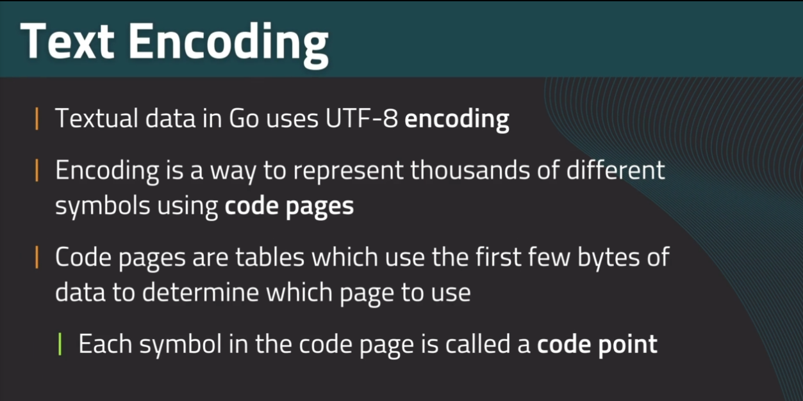


in go when we work with strings and runes we're actually working with individual bites, not letters themselves

**Runes**


**Strings**


## Go CLI


----------
# Fundamentals 

## Variables

```go
// compound creation
var a, b, c = 1, 2, "sample"

// Block Creation
var (
	a int = 1
	b int = 2
	// type inference
	c = "sample"
)

// Create & Assign shortcut
example := 3
a, b := 1, "sample"

word1, word2, _ := "one", "two" , "!"
```


## Functions


```go
func sum(a int, b int) int{
	return a + b
}

func sum(a, b int) int{
	return a + b
}
```
**Multiple Return Values**


**Go function naming convention is camelCase**

## Operators


## if..else


**statement initialization** allows us to create a variable and do a comparison an the same time.


**Early Return**
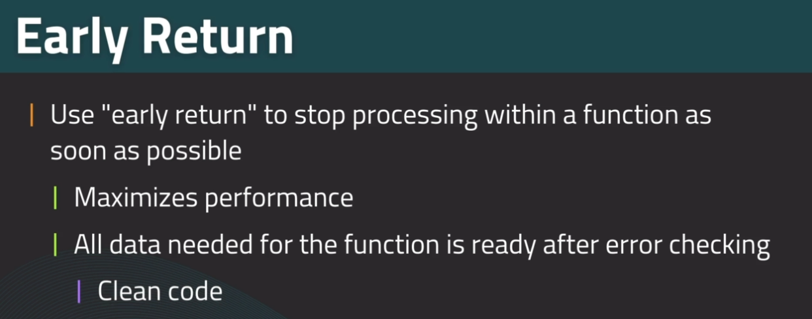


## Switch


**Conditional Case**


**Case List**


**FAllthrough**


## Loops


**For: While**

**For: Infinite**

**Continue**


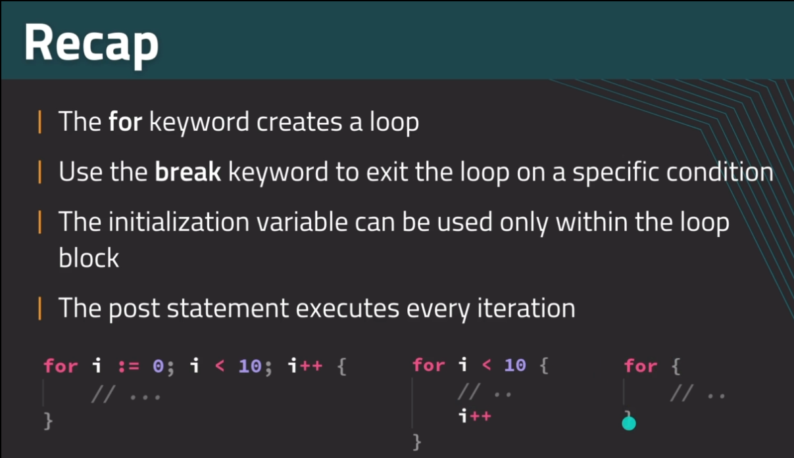

----------

# Types

## Structures

**Defining a Structure**

**instantiating a structure**

**Default Values**

**Accessing Fields**

**Anonymous Structures**


## Arrays

**Visualization**

**Creating an Array**

**Accessing Array Elements**

**Iteration**

**Bounds**


## Slices

**Visualization**
slice is not copy the array , just a reference

**Creating a Slice**
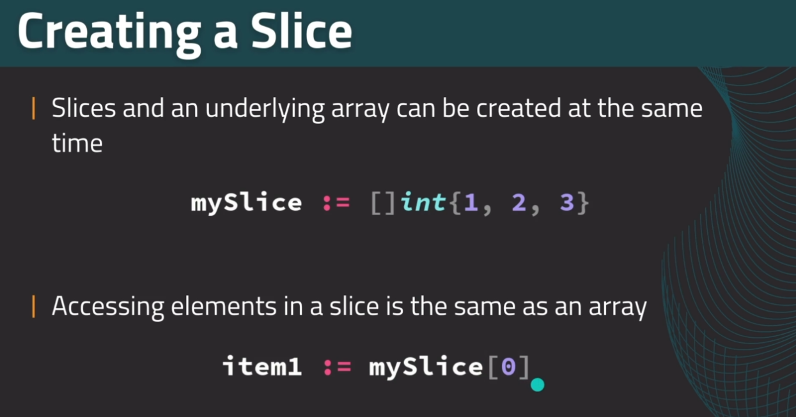
**Slice Syntax**

**Example**

**Dynamic Arrays**
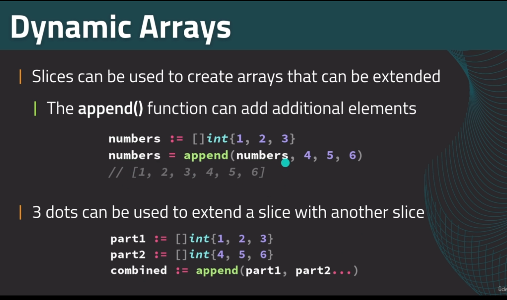
**Preallocation**

**Slices to Functions**

**Multidimensional Slices**

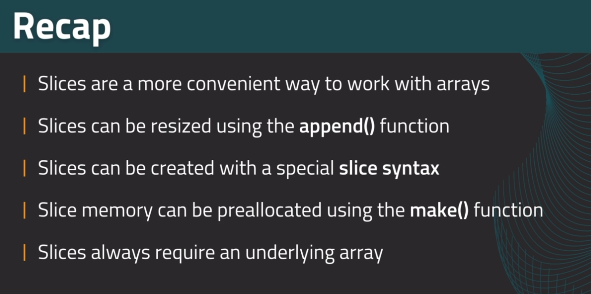

## Ranges

```go
func main() {
	slice := []string{"Hello", "world", "!"}
	for i, el := range slice {
		fmt.Println(i, el, ":")
		for _, ch := range el {
			fmt.Printf("%q\n", ch)

		}
	}
}
```

## Maps

**Making a Map**

**Map Operations**

**Iteration**


## Pointers


**creating Pointers**

**Using Pointers**
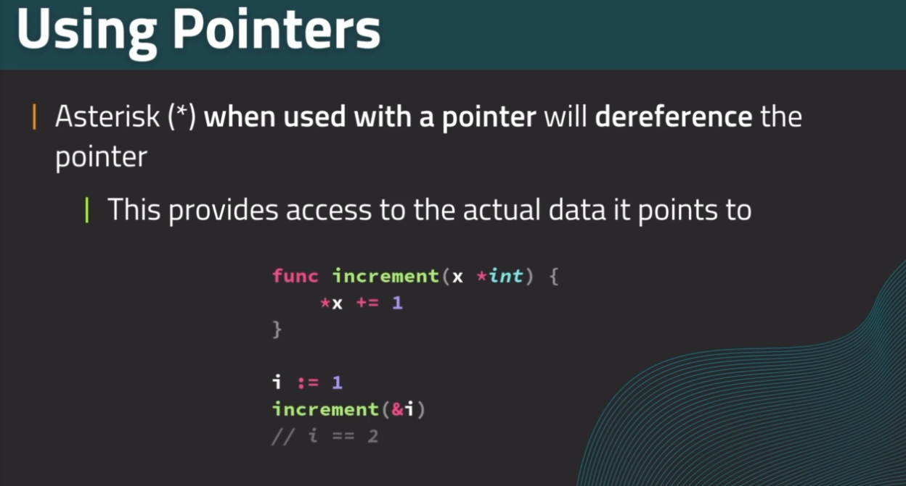
**Pointers Visualized**


----------
#  Idiomatic Go

## Receiver Functions


## iota
**About**

**iota**

**Skipping values**

**iota Enumeration Pattern**


**Recap**
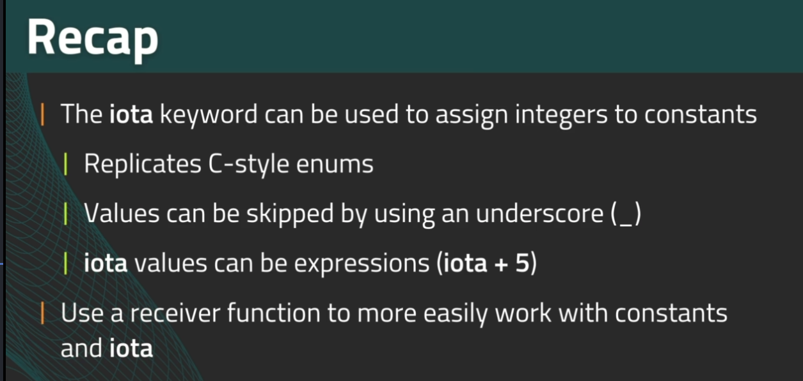

## Variadics

so Variadics are just a way to make a function that accepts any number of parameters.

```go
func sum(nums ...int) int {
	// the nums variable is actually slice of int
	sum :=0
	for _,n := range nums{
		sum += n
	}
	return sum
}

a := []int{1,2,3}
result := sum(a...)
```

## Text Formatting: fmt

**Printf**
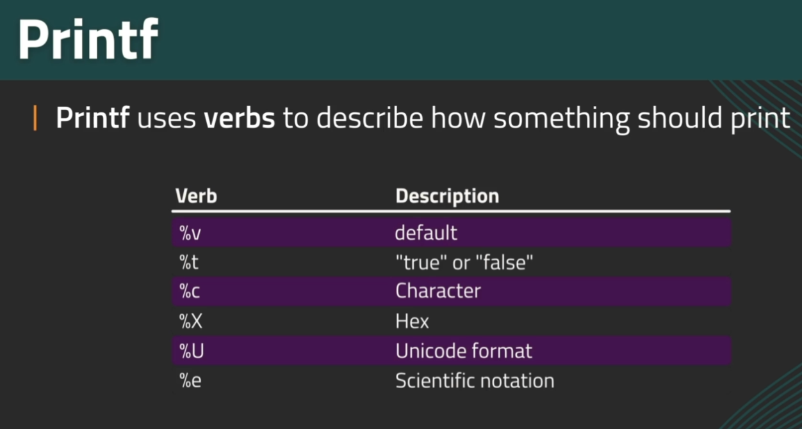
**Escape Sequences**

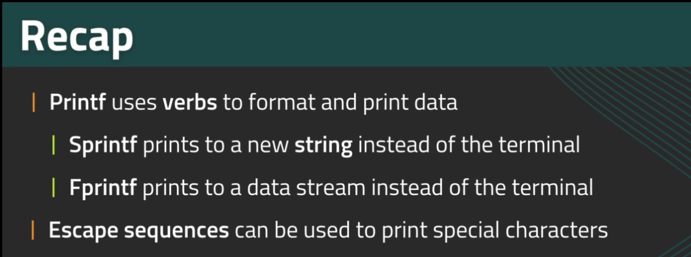

## Packages 

**Public and Private in go is essentially based on whether or not you capitalize the first letter of a function of structure or type alias**

## init Function

**Each package can have it's own inti() function**
**All packages will execute init() before main() runs**

## Testing


**Available Testing Function**

**Test Table**
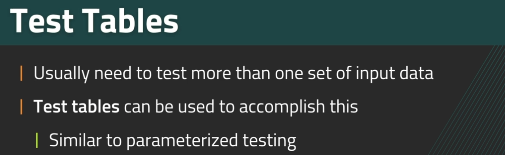


---------------------
# Interfaces

**Creation & Implementation**

**Notes**

**Pass By value vs Pointer**


