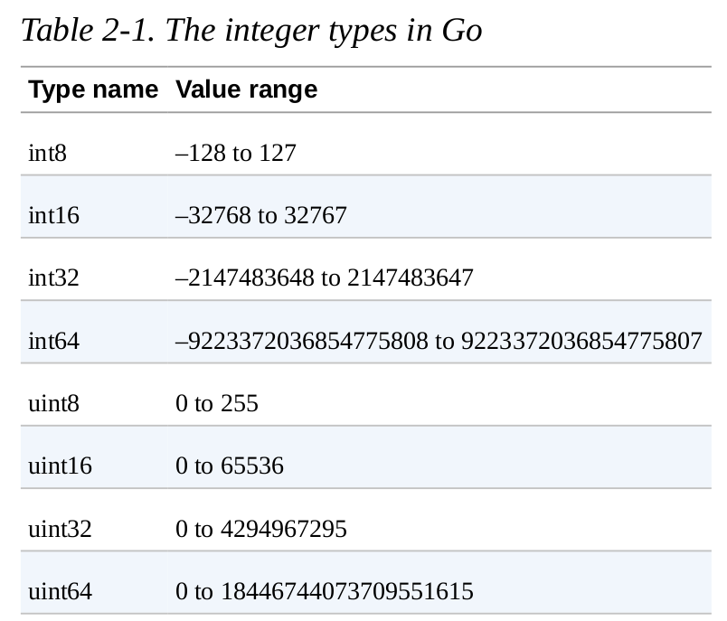
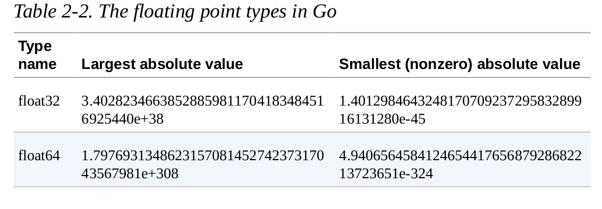

## Using Go Modules

## Creating a new module
` go module init example.com/username/repo`

## Adding a dependency
` go get rsc.io/quote`

## show all direct an indirect dependencies
`go list -m all`

## Upgrading dependencies
` go get golang.org/x/text`
`go list -m -versions rsc.io/sampler`
`go get rsc.io/sampler@v1.3.1`
`go doc rsc.io/quote/v3`

## Removing unused dependencies
`go mod tidy`

# Identifiers
https://go.dev/ref/spec#Identifiers

## Extended Backus–Naur form (EBNF)
https://en.wikipedia.org/wiki/Extended_Backus%E2%80%93Naur_form

----------------------------------------------------------------------------

# Learning Go An Idiomatic Approach to Real-World Go Programming (Jon Bodner [Jon Bodner]) (z-lib.org)

## install and config golang

search and do this step from the web.

## the go command

### `go run main.go`

The go run command does in fact compile your code into a binary. \
However, the binary is built in a temporary directory. The go run \
command builds the binary, executes the binary from that temporary \
directory, and then deletes the binary after your program finishes. \
This makes the go run command useful for testing out small programs or\
using Go like a scripting language. 

**Use go run when you want to treat a Go program like a script and run the source code
immediately.**

### `go build main.go`

Use go build to create a binary that is distributed for other people to use. Most of the \
time, this is what you want to do. Use the -o flag to give the binary a different name or \
location. 

### Getting Third-Party Go Tools

`go install github.com/rakyll/hey@latest `

Go’s method for publishing code is a bit different than most other \
languages. Go developers don’t rely on a centrally hosted service, like \
Maven Central for Java or the NPM registry for JavaScript. Instead, they \
share projects via their source code repositories. The go install \
command takes an argument, which is the location of the source code \
repository of the project you want to install, followed by an @ and the \
version of the tool you want (if you just want to get the latest version, use \
@latest). It then downloads, compiles, and installs the tool into your \
`$GOPATH/bin` directory.

**If you have already installed a tool and want to update it to a newer version,
rerun go install with the newer version specified or with @latest:**

#### GOPROXY 

As we’ll talk about in “Module Proxy Servers”, the contents of Go repositories are 
cached in proxy servers. Depending on the repository and the values in your GOPROXY 
environment variable, go install may download from a proxy or directly from a
repository. If go install downloads directly from a repository, it relies on
command-line tools being installed on your computer. For example, you must have Git
installed to download from GitHub.

### Formatting Your Code

**The Go development tools include a command, go fmt, which
automatically reformats your code to match the standard format**

`go install golang.org/x/tools/cmd/goimports@latest`

`goimports -l -w .`

### Linting and Vetting

https://github.com/golang/go/wiki/CodeReviewComments

**install golint with following command**

`go install golang.org/x/lint/golint@latest`

`golint ./...`

There is another class of errors that developers run into. The code is \
syntactically valid, but there are mistakes that are not what you meant to do. \
This includes things like passing the wrong number of parameters to \
formatting methods or assigning values to variables that are never used. The \
go tool includes a command called go vet to detect these kinds of errors. \
Run go vet on your code with the command:

`go vet ./...`

There are additional third-party tools to check code style and scan for \
potential bugs. However, running multiple tools over your code slows down \
the build because each tool spends time scanning the source code for itself. \
Rather than use separate tools, you can run multiple tools together with \
golangci-lint. It combines golint, go vet, and an ever-increasing \
set of other code quality tools. Once it is installed, you run golangci-
lint with the command: \

`golangci-lint run`

----------------------------------------------------------------------------

# Chapter 2. Primitive Types and Declarations

## Built-in Types

**The Zero Value**

assigns a default zero value to any variable that is declared but not assigned a value.

### Literals

1. **Integer literals** are sequences of numbers; they are normally base ten, but
different prefixes are used to indicate other bases: 0b for binary (base two),
0o for octal (base eight), or 0x for hexadecimal (base sixteen).

To make it easier to read longer integer literals, Go allows you to put \
underscores in the middle of your literal. This allows you to, for example, \
group by thousands in base ten (1_234). 

2. **Floating point literals**
4.  **Rune literals** represent characters and are surrounded by single quotes. \
Unlike many other languages, in Go single quotes and double quotes are not \
interchangeable. Rune literals can be written as single Unicode characters \
('a'), 8-bit octal numbers ('\141'), 8-bit hexadecimal numbers \
('\x61'), 16-bit hexadecimal numbers ('\u0061'), or 32-bit Unicode \
numbers ('\U00000061')
5. **string literals**
6. **raw string literal**

### Booleans

`go
var flag bool // no value assigned, set to false
var isAwesome = true
`

### Numeric Types

1. **Integer types**

2. **The special integer types**

- A byte is an alias for uint8 
- int alias for int32 or int64
- uint. alias for uint32 or uint64

### Choosing which integer to use ?

- If you are working with a binary file format or network protocol
that has an integer of a specific size or sign, use the corresponding
integer type.

- If you are writing a library function that should work with any
integer type, write a pair of functions, one with int64 for the
parameters and variables and the other with uint64. 

- In all other cases, just use int.

3. **Floating point types**

