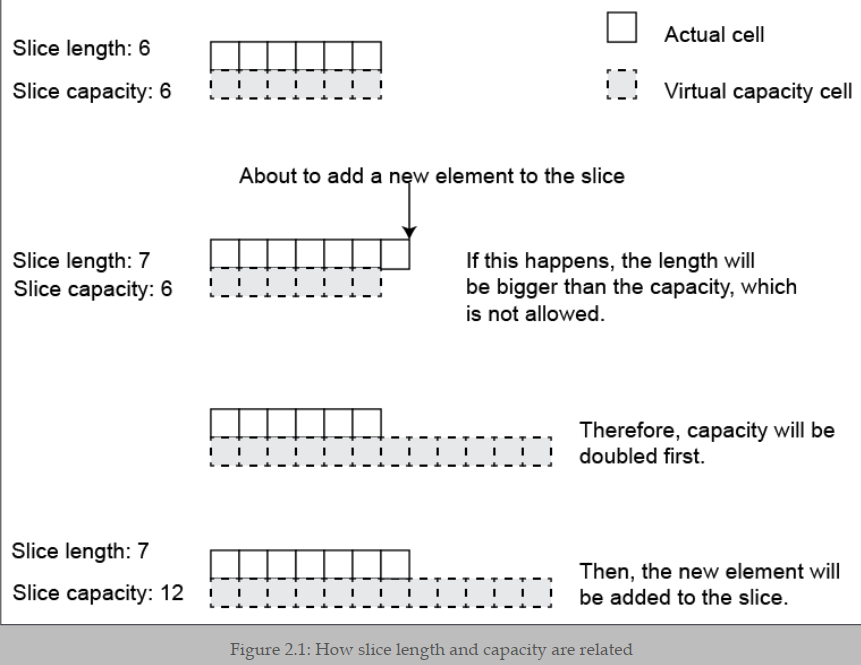
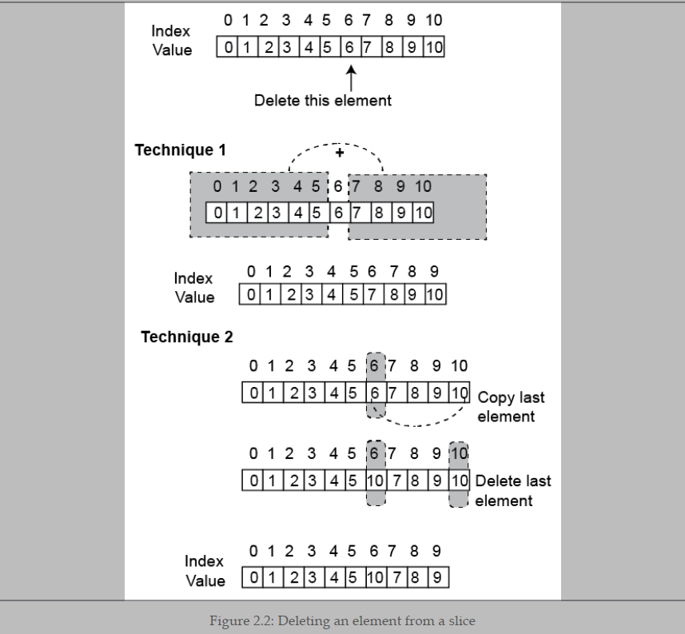
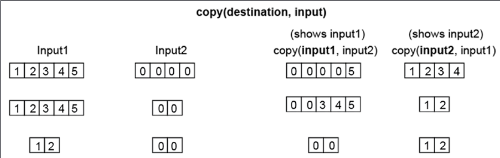
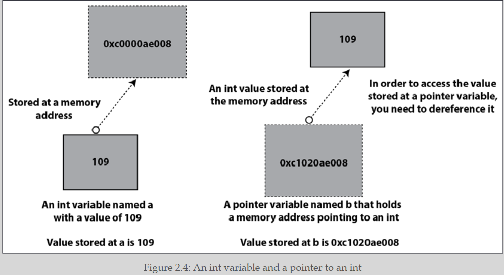

## A Quick Introduction to Go

### Introducing Go

- Go is an open-source systems programming language.
- public back in 2009.
- Robert Griesemer, Ken Thomson, and Rob Pike.
-  Go is a general-purpose programming language

**Go does better than other programming language :**

1. The default behavior of the Go compiler can catch a large set of silly errors that might result in bugs.
2. Go uses fewer parentheses than C, C++, or Java, and no semicolons, which makes the look of Go source code more human-readable and less errorprone.
3. Go comes with a rich and reliable standard library.
4. Go has support for concurrency out of the box through goroutines and channels.
5. Goroutines are really lightweight. You can easily run thousands of goroutines on any modern machine without any performance issues.
6. Unlike C, Go supports functional programming.
7. Go code is backward compatible, which means that newer versions of the Go
compiler accept programs that were created using a previous version of the
language without any modifications. This compatibility guarantee is limited
to major versions of Go. For example, there is no guarantee that a Go 1.x
program will compile with Go 2.x.

### The history of Go

- Go started as an internal Google project.
-  Go as a language for professional programmers who want to build .reliable, robust, and efficient software. 
- the Go compiler can find difficult to catch mistakes such as race
conditions.
  
### The advantages of Go

- Go has reserved only 25 keywords.
- concurrency capabilities using a simple concurrency model that
is implemented using goroutines and channel.
- Go manages OS threads for you
and has a powerful runtime that allows you to spawn lightweight units of work (goroutines) that communicate with each other using channels.
- Go's executable binaries are statically
linked, which means that once they are generated, they do not depend on any shared libraries and include all required information.
-  does not have strange side effects, and although Go supports pointers.
-  Go is not an object-oriented programming language, Go interfaces
are very versatile and allow you to mimic some of the capabilities of object-oriented languages such as polymorphism, encapsulation, and composition.
-  the latest Go versions offer support for generics, which simplifies your code when working with multiple data types.

**Although Go is a very practical and competent programming language, it is not perfect:**

-  Go has no direct support for object-oriented programming,
which is a popular programming paradigm.
- Although goroutines are lightweight, they are not as powerful as OS threads.
- Go will not allow you to perform any memory management manually

### The go doc and godoc utilities

- `go doc fmt.Printf`
- `go doc fmt`

- `go install golang.org/x/tools/cmd/godoc@latest`
-  `godoc -http=:8001`

###  Introducing functions

there is a global Go rule that also applies to function and variable names and is valid for all packages except main:
**everything that begins with a lowercase letter is considered private and is accessible in the current package only**

### Introducing packages

- Go programs are organized in packages—even the smallest Go program should be delivered as a package.

- if you are creating an executable application and not just a package that will be shared by other
applications or packages, you should name your package main

### Running Go code

- there are two ways to execute Go code:
as a compiled language using `go build` or as a scripting language using `go run`.

### Compiling Go codes

` go build -o helloWorld hw.go`

### Using Go like a scripting language

The go run command builds the named Go package, which in this case is the main package implemented in a single file, creates a       temporary executable file, executes
that file, and deletes it once it is done—to our eyes, this looks like using a scripting
language.

`go run hw.go`

### Defining and using variables

-  if no initial value is given to a variable,
the Go compiler will automatically initialize that variable to the zero value of its
data type.

-  The official name for := is short assignment statement.
-  the var keyword is mostly used for
declaring global or local variables without an initial value.
- every statement that exists outside of the code of a function must begin with a keyword such as func or var.
- the short assignment statement cannot be used outside of a function environment because it is not available there.
- Global variables can be accessed from anywhere in a
package without the need to explicitly pass them to a function and can be changed unless they were defined as constants using the const keyword.

### Controlling program flow

```go
// With expression after switch
switch argument {
case "0":
fmt.Println("Zero!")
fallthrough
default:
fmt.Println("Value:", argument)
}
```

```go
// No expression after switch
switch {
case value == 0:
fmt.Println("Zero!")
case value > 0:
fmt.Println("Positive integer")
case value < 0:
fmt.Println("Negative integer")
default:
fmt.Println("This should not happen:", value)
}
```

### Iterating with for loops and range

- depending on how you write a for loop, it can function as
a while loop or an infinite loop. Moreover, for loops can implement the functionality
of JavaScript's forEach function when combined with the range keyword.

-  for and range allow you to iterate over the elements
of a map in a similar way.

```go
// Traditional for loop
for i := 0; i < 10; i++ {
fmt.Print(i*i, " ")
}


// For loop used as while loop
i := 0
for {
if i == 10 {
break
}
fmt.Print(i*i, " ")
i++
}

// This is a slice but range also works with arrays
aSlice := []int{-1, 2, 1, -1, 2, -2}
for i, v := range aSlice {
fmt.Println("index:", i, "value: ", v)
}
```

### Reading from standard input

- `fmt.Scanln()`
-  read user input while the program is
already running and store it to a string variable, which is passed as a pointer to
fmt.Scanln().

### Working with command-line arguments

- command-line arguments
in Go are stored in the os.Args slice. Go also offers the flag package for parsing
command-line arguments, but there are better and more powerful alternatives.

```go
	arguments := os.Args
	var number float64
	for i := 1; i < len(arguments); i++ {

		n, err := strconv.ParseFloat(arguments[i], 64)
		if err != nil {
			continue
		}
		number = n
	}
```

### Understanding the Go concurrency model

- The Go concurrency model is implemented using goroutines and channels.
- A goroutine is the smallest executable Go entity.
- In order to create a new goroutine, you have to use
the go keyword followed by a predefined function or an anonymous function.
- A channel in Go is a mechanism that, among other things, allows goroutines to communicate and exchange data.
-  goroutines are do not share any variables, they can share memory.

### sDeveloping the which(1) utility in Go

- Go can work with your operating system through a set of packages.

```go
package main

import (
	"fmt"
	"os"
	"path/filepath"
)

func main() {
	arguments := os.Args
	if len(arguments) == 1 {
		fmt.Println("Please provide an argument!")
		return
	}
	file := arguments[1]
	path := os.Getenv("PATH")
	pathSplit := filepath.SplitList(path)
	for _, directory := range pathSplit {
		fullPath := filepath.Join(directory, file)
		// Does it exist?
		fileInfo, err := os.Stat(fullPath)
		if err == nil {
			mode := fileInfo.Mode()
			// Is it a regular file?
			if mode.IsRegular() {
				// Is it executable?
				if mode&0111 != 0 {
					fmt.Println(fullPath)
					return
				}
			}
		}
	}
}
```

### Logging information

- As we usually run our services via systemd, programs should log to stdout so systemd can put logging data in the journal.
- The UNIX logging service has support for two properties named logging level and logging facility
-  The logging level is a value that specifies the severity of the log entry. There are various logging levels, including debug, info, notice, warning, err, crit, alert, and emerg, in reverse order of severity
-  The log package of the standard Go library does not support working with logging levels.
- The logging facility is like
a category used for logging information. The value of the logging facility part can be
one of auth, authpriv, cron, daemon, kern, lpr, mail, mark, news, syslog, user, UUCP,
local0, local1, local2, local3, local4, local5, local6, or local7 and is defined
inside /etc/syslog.conf, /etc/rsyslog.conf, or another appropriate file.
-  if a logging facility is not defined correctly, it will not be handled.
-  The log package sends log messages to standard error.
-  Part of the log package is the
log/syslog package, which allows you to send log messages to the syslog server of your machine.
- **Logging is for application code, not library code. If you are developing libraries, do not put logging in them.**

- how to use the log and log/syslog packages to log messages to the system syslog on a Unix-like operating system :
```go
package main
import (
"log" //  This is the standard Go package for logging.
"log/syslog" // This package provides functionality to interact with the system's syslog facility.
)
func main() {
// LOG_SYSLOG :This specifies the facility for logging
sysLog, err := syslog.New(syslog.LOG_SYSLOG, "systemLog.go")
if err != nil {
log.Println(err)
return
} else {
log.SetOutput(sysLog)
log.Print("Everything is fine!")
}
}
```
### log.Fatal() and log.Panic()

- The log.Fatal() function is used when something erroneous has happened and you just want to exit your program as soon as possible after reporting that bad situation.
- The call to log.Fatal() terminates a Go program at the point where log.Fatal() was called after printing an error message.
-  it returns back a non-zero exit code, which in UNIX indicates an error.

- There are situations where a program is about to fail for good and you want to
have as much information about the failure as possible—log.Panic() implies that something really unexpected and unknown.
- log.Panic() prints a custom message and immediately
terminates the Go program.
- **log.Panic() is equivalent to a call to log.Print() + panic(). panic() > stops the execution of the current function and begins panicking. After that, it returns to the caller function**

- **log.Fatal() is equivalent to a call to log.Print() + os.Exit(1) immediate way of terminating the current program**

### Overview of Go generics

- Go supports multiple data types in functions such as fmt.Println()
using the empty interface and reflection.
- generics comes into play for providing an alternative to the use
of interfaces and reflection for supporting multiple data types. 
```go
package main
import (
"fmt"
)
func Print[T any](s []T) {
for _, v := range s {
fmt.Print(v, " ")
}
fmt.Println()
}
func main() {
Ints := []int{1, 2, 3}
Strings := []string{"One", "Two", "Three"}
Print(Ints)
Print(Strings)
}
```

-  I believe that generics should be used when they can create simpler code and
designs. It is better to have repetitive straightforward code than optimal abstractions that slow down your applications.

---

## Basic Go Data Types

### The error data type

- Go provides a special data type for representing error conditions and error messages named error.
- this means that Go treats errors as values.
- if the value of an error variable is nil, then there was no error
- if you want to create your own error messages, you can use `errors.New()` from the errors package.
- This usually happens inside a function other than main()
because main() does not return anything to any other function. 
- You will most likely work with errors in your programs without
needing the functionality of the errors package. Additionally,
you do not need to define custom error messages unless you are
creating big applications or packages.
- If you want to format your error messages in the way `fmt.Printf()` works, you can use the `fmt.Errorf()` function, which simplifies the creation of custom error messages—the `fmt.Errorf()` function returns an error value just like `errors.New()`.

```go

package main
import (
"errors"
"fmt"
"os"
"strconv"
)

return errors.New("this is a custom error message")

return fmt.Errorf("a %d and b %d. UserID: %d", a, b, os.Getuid())
```

**you should have a global error handling tactic in each application that should not change. In practice, this means the following:**

- All error messages should be handled at the same level, which means that
all errors should either be returned to the calling function or be handled at the place they occurred.
- It is considered a good practice to send all error messages to the log service of your machine

### Numeric data types

| Data Type  | Description                       |
| ---------- | --------------------------------- |
| int8       | 8-bit signed integer              |
| int16      | 16-bit signed integer             |
| int32      | 32-bit signed integer             |
| int64      | 64-bit signed integer             |
| int        | 32- or 64-bit signed integer      |
| uint8      | 8-bit unsigned integer            |
| uint16     | 16-bit unsigned integer           |
| uint32     | 32-bit unsigned integer           |
| uint64     | 64-bit unsigned integer           |
| uint       | 32- or 64-bit unsigned integer    |
| float32    | 32-bit floating-point number      |
| float64    | 64-bit floating-point number      |
| complex64  | Complex number with float32 parts |
| Complex128 | Complex number with float64 parts |

- The int and uint data types are special as they are the most efficient sizes for signed
and unsigned integers on a given platform and can be either 32 or 64 bits each—their size is defined by Go itself. 

### Non-numeric data types

- Go has support for Strings, Characters, Runes, Dates, and Times. 
-For Go, dates and times are the same thing and are represented by
the same data type.

#### Strings, Characters, and Runes:

- A Go string is just a collection of bytes and can be accessed as a whole or as an array.

- ASCII: ASCII is a 7-bit encoding system, which means it uses 7 bits (128 possible values) to represent characters. It was originally designed for encoding basic English characters, control characters (e.g., carriage return, line feed), and some common symbols.
- A single byte can store any ASCII character.
  
- Unicode: Unicode, on the other hand, is a much more comprehensive character encoding system. It uses 16 bits (65536 possible values) to represent characters, allowing it to encompass a vast range of characters from various scripts and languages around the world.

- multiple bytes are usually needed for storing a single Unicode character.

- Go is designed with Unicode support in mind. which is the main reason for having the rune data type.
  
- A rune is an int32 value that is used for representing a single
Unicode code point.

- Although a rune is an int32 value, you cannot compare a rune
with an int32 value. Go considers these two data types as totally
different.

- You can create a new byte slice from a given string by using a []byte("A String") statement. ( byte slices that contain Unicode characters).
- You can define a rune using single quotes: `r := '€' `and you can print the integer value of the bytes that compose it as `fmt.Println(r)`
- Printing it as a single Unicode character requires the use of the `%c` control string in `fmt.Printf()`.
- The length of the string is the same as the number of characters found in the string,which is usually not true for byte slices because Unicode characters usually require more than one byte.
  

```go

package main

import "fmt"

func main() {

    // a string literal that contains a Unicode character
	aString := "Hello World! €"
	fmt.Println("First character", aString[0])         
	fmt.Println("First character", string(aString[0])) 

	// A rune
	r := '€'
	fmt.Println("As an int32 value:", r)
	// Convert Runes to text
	fmt.Printf("As a string: %s and as a character: %c\n", r, r)

	// Print an existing string as runes
	for _, v := range aString {
		fmt.Printf("%x ", v)
	}
	fmt.Println()

	// Print an existing string as characters
	for _, v := range aString {
		fmt.Printf("%c", v)
	}
	fmt.Println()

}
```

#### Converting from int to string

1. using string()
2. using a function from the strconv package

**However, the two methods are fundamentally different. The `string()` function converts an integer value into a Unicode code point, which is a single character, whereas functions such as `strconv. FormatInt()` and `strconv.Itoa()` convert an integer value into a string value with the same representation and the same number of characters.**

```go
// n = 100
input := strconv.Itoa(n) // "100"
input = strconv.FormatInt(int64(n), 10) // "100"
input = string(n) // "d"
```

#### The unicode package

- The unicode standard Go package contains various handy functions for working with Unicode code points.
- `unicode.IsPrint()`, can help you to identify the parts of a string that are printable using runes.
- This utility is very handy for filtering your input or filtering data before printing it on screen, storing it in log files transferring it on a network, or storing it in a database.


```go
package main
import (
    "fmt"
    "log"
    "unicode"
)
func main() {
    dataToLog := "This is some log data with non-printable characters: \x07"
    if !unicode.IsPrint(dataToLog) {
        log.Fatal("Log data contains non-printable characters.")
    }
    log.Println(dataToLog)
}
```
#### The strings package
- If you are working with text and text processing, you definitely need to learn all the gory details and functions of the strings package
- https://github.com/mactsouk/mastering-Go-3rd/blob/main/ch02/useStrings.go
- https://pkg.go.dev/strings

### Times and dates
- The king of working with times and dates in Go is the `time.Time` data type, which represents an instant in time with *nanosecond precision*. Each `time.Time` value is associated with a **location (time zone)**.
- **when you want to parse a date or time string, you need to use a specific format string to match the structure of the input string. It mentions that if you have a date string like "30 January 2020," you should use the format "02 January 2006" to parse it correctly**
- The next table shows the most widely used strings for parsing dates and times:

| Parse Value | Meaning (examples)                   |
| ----------- | ------------------------------------ |
| 05          | 12-hour value (12pm, 07am)           |
| 15          | 24-hour value (23, 07)               |
| 04          | Minutes (55, 15)                     |
| 05          | Seconds (5, 23)                      |
| Mon         | Abbreviated day of week (Tue, Fri)   |
| Monday      | Day of week (Tuesday, Friday)        |
| 02          | Day of month (15, 31)                |
| 2006        | Year with 4 digits (2020, 2004)      |
| 06          | Year with the last 2 digits (20, 04) |
| Jan         | Abbreviated month name (Feb, Mar)    |
| January     | Full month name (July, August)       |
| MST         | Time zone (EST, UTC)                 |

```go
package main

import (
    "fmt"
    "time"
)

func main() {
    inputDate := "30 January 2020"
    format := "02 January 2006" // write this format from table above.
    parsedDate, err := time.Parse(format, inputDate)
    if err != nil {
        fmt.Println("Error:", err)
        return
    }
    fmt.Println("Parsed Date:", parsedDate.Format("02 January 2006"))
}
```

#### A utility for parsing dates and times

```go
package main
import (
"fmt"
"os"
"time"
)

// Is this a date only?
d, err := time.Parse("02 January 2006", dateString)
if err == nil {
fmt.Println("Full:", d)
fmt.Println("Time:", d.Day(), d.Month(), d.Year())

// Is this a date + time?
d, err = time.Parse("02 January 2006 15:04", dateString)
if err == nil {
fmt.Println("Full:", d)
fmt.Println("Date:", d.Day(), d.Month(), d.Year())
fmt.Println("Time:", d.Hour(), d.Minute())
}

// Is this a date + time with month represented as a number?
d, err = time.Parse("02-01-2006 15:04", dateString)
if err == nil {
fmt.Println("Full:", d)
fmt.Println("Date:", d.Day(), d.Month(), d.Year())
fmt.Println("Time:", d.Hour(), d.Minute())
}

// Is it time only?
d, err = time.Parse("15:04", dateString)
if err == nil {
fmt.Println("Full:", d)
fmt.Println("Time:", d.Hour(), d.Minute())
}
```
#### Working with different time zones

1.  you need time.Parse() in order to convert a valid input into a time.Time value before doing the conversions. This time the input string contains the time zone and is parsed by the *"02 January 2006 15:04 MST*" string.
2.  
```go
  package main

import (
	"fmt"
	"os"
	"time"
)

func main() {

	if len(os.Args) == 1 {
		fmt.Println("Need input in __02 January 2006 15:04 MST__ format!")
		return
	}

	input := os.Args[1]
	now, err := time.Parse("02 January 2006 15:04 MST", input)
	if err != nil {
		fmt.Println(err)
		return
	}

	// Local time
	loc, _ := time.LoadLocation("Local")
	fmt.Printf("Current Location: %s\n", now.In(loc))

	// NY
	loc, _ = time.LoadLocation("America/New_York")
	fmt.Printf("New York Time: %s\n", now.In(loc))

	// London
	loc, _ = time.LoadLocation("Europe/London")
	fmt.Printf("London Time: %s\n", now.In(loc))

	// Tokyo
	loc, _ = time.LoadLocation("Asia/Tokyo")
	fmt.Printf("Tokyo Time: %s\n", now.In(loc))
}
```

### Go constants

- Go supports constants, which are variables that cannot change their values.
- the value of a constant variable is defined at compile time, not at runtime—this means that it is included in the binary executable.
- Behind the scenes, Go uses Boolean, string, or number as the type for storing constant values because this gives Go more flexibility when dealing with constants.

#### The constant generator iota

- Although we are defining constants inside main(), constants can be normally found outside of main() or any other function or method.
- The constant generator iota is used for declaring a sequence of related values that use incrementing numbers without the need to explicitly type each one of them.

```go
const PI = 3.1415926
const (
C1 = "C1C1C1"
C2 = "C2C2C2"
C3 = "C3C3C3"
)


const (
Zero int = iota
One
Two
Three
Four
)
const (
Zero = 0
One = 1
Two = 2
Three = 3
Four = 4
)

// constants using bitwise left shift (<<) operations and the iota enumerator
const (
    p2_0 Power2 = 1 << iota // 1 << 0 = 1
    _                      // Blank identifier (_) discards the value
    p2_2 Power2 = 1 << iota // 1 << 2 = 4
    _                      // Blank identifier (_) discards the value
    p2_4 Power2 = 1 << iota // 1 << 4 = 16
    _                      // Blank identifier (_) discards the value
    p2_6 Power2 = 1 << iota // 1 << 6 = 64
)
```

### Grouping similar data
- Go provides an alternative to arrays that is called a **slice**.
- The quick answer is that you can use slices instead of arrays almost anywhere in Go but we are also demonstrating arrays because they can still be useful and because slices are implemented by Go using arrays.

#### Arrays
- When defining an array variable, you must define its size Otherwise, you should put `[...]` in the array declaration and let the Go compiler find out the length for you.
- **If you put nothing in the square brackets, then a slice is going to be created instead**
```go
[4]string{"Zero", "One", "Two", "Three"}
[...]string{"Zero","One", "Two", "Three"}
```
- You cannot change the size of an array after you have created it.
- When you pass an array to a function, what is happening is thatGo creates a copy of that array and passes that copy to that function.
- **As a result, arrays in Go are not very powerful, which is the main reason that Go has introduced an additional data structure named slice**
  
#### Slices
- they are dynamic, which means that they can grow or shrink after creation if needed.
- **any changes you make to a slice inside a function also affect the original slice**.
- **all parameters in Go are passed by value—there is no other way to pass parameters in Go.**
- **In reality, a slice value is a header that contains a pointer to an underlying array where the elements are actually stored, the length of the array, and its capacity.Note that the slice value does not include its elements, just a pointer to the underlying array. So, when you pass a slice to a function, Go makes a copy of that header and passes it to the function. This copy of the slice header includes the pointer to the underlying array.**
- That slice header is defined in the reflect package (https:// golang.org/pkg/reflect/#SliceHeader)
- A side effect of passing the slice header is that it is faster to pass a slice to a function because Go does not need to make a copy of the slice and its elements, just the slice header.

```go
type SliceHeader struct {
Data uintptr
Len int
Cap int
}
```

- If you do not want to initialize a slice, then using `make()` is better and faster. `make([]float64, 3)`
- if you want to initialize it at the time of creation, then `make()` cannot help you. As a result, you can create a slice with three float64 elements as `aSlice :=[]float64{1.2, 3.2, -4.5}`.
  
- Both slices and arrays can have many dimensions:
  1. `make([][]int, 2)`
  2. `twoD := [][]int{{1, 2, 3}, {4, 5, 6}}`

- You can find the length of an array or a slice using `len() ` . 
- You can add new elements to a full slice using the `append()`.
- **`append()` automatically allocates the required memory space.**
- The `append()` commands add two new elements to aSlice. You should save the return value of `append()` to an existing variable or a new one. 

```go
package main

import "fmt"

func main() {
	// Create an empty slice
	aSlice := []float64{}
	// Both length and capacity are 0 because aSlice is empty
	fmt.Println(aSlice, len(aSlice), cap(aSlice))

	// Add elements to a slice
	aSlice = append(aSlice, 1234.56)
	aSlice = append(aSlice, -34.0)
	fmt.Println(aSlice, "with length", len(aSlice))

	// A slice with length 4
	t := make([]int, 4)
	t[0] = -1
	t[1] = -2
	t[2] = -3
	t[3] = -4
	// Once a slice has no place left for more elements, you should add new elements to it using append().
	t = append(t, -5)
	fmt.Println(t)

	// A 2D slice
	// You can have as many dimensions as needed
	twoD := [][]int{{1, 2, 3}, {4, 5, 6}}

	// Visiting all elements of a 2D slice
	// with a double for loop
	for _, i := range twoD {
		for _, k := range i {
			fmt.Print(k, " ")
		}
		fmt.Println()
	}

	make2D := make([][]int, 2)
	fmt.Println(make2D)
	make2D[0] = []int{1, 2, 3, 4}
	make2D[1] = []int{-1, -2, -3, -4}
	fmt.Println(make2D)
}
```

#### About slice length and capacity
- Both arrays and slices support the `len()` function for finding out their length.
- slices also have an additional property called **capacity** that can be found using the `cap()` function.
- **The capacity shows how much a slice can be expanded without the need to allocate more memory and change the underlying array.**
- Although after slice creation the capacity of a slice is handled by **Go**, a developer can define the capacity of a slice at creation time using the `make()` function.
- **the capacity of the slice doubles each time the length of the slice is about to become bigger than its current capacity.**
- ` make([]int, 3, 6)`
- But what happens when you want to append a slice or an array to an existing slice? Should you do that element by element? Go supports the ... operator, which is used for exploding a slice or an array into multiple arguments before appending it to an existing slice.
<div style="text-align:center">
  
</div>

```go
package main
import "fmt"
func main() {
	// Only length is defined. Capacity = length
	a := make([]int, 4)
	fmt.Println("L:", len(a), "C:", cap(a))
	// Initialize slice. Capacity = length
	b := []int{0, 1, 2, 3, 4}
	fmt.Println("L:", len(b), "C:", cap(b))
	// Same length and capacity
	aSlice := make([]int, 4, 4)
	fmt.Println(aSlice)
	// Add an element
	aSlice = append(aSlice, 5)
	fmt.Println(aSlice)
	// The capacity is doubled
	fmt.Println("L:", len(aSlice), "C:", cap(aSlice))
	// Now add four elements
	aSlice = append(aSlice, []int{-1, -2, -3, -4}...)
	fmt.Println(aSlice)
	// The capacity is doubled
	fmt.Println("L:", len(aSlice), "C:", cap(aSlice))
}
```
**Setting the correct capacity of a slice, if known in advance, will make your programs faster because Go will not have to allocate a new underlying array and have all the data copied over.**

#### Selecting a part of a slice
- using `aSlice[0:2:4]` selects the first 2 elements of a slice (at indexes 0 and 1) and creates a new slice with a maximum capacity of 4

```go
package main
import "fmt"
func main() {
	aSlice := []int{0, 1, 2, 3, 4, 5, 6, 7, 8, 9}
	fmt.Println(aSlice)
	l := len(aSlice)

	// First 5 elements
	fmt.Println(aSlice[0:5])
	// First 5 elements
	fmt.Println(aSlice[:5])

	// Last 2 elements
	fmt.Println(aSlice[l-2 : l])

	// Last 2 elements
	fmt.Println(aSlice[l-2:])

	// First 5 elements
	t := aSlice[0:5:10]
	fmt.Println(len(t), cap(t))

	// Elements at indexes 2,3,4
	// Capacity will be 10-2
	t = aSlice[2:5:10]
	fmt.Println(len(t), cap(t))

	// Elements at indexes 0,1,2,3,4
	// New capacity will be 6-0
	t = aSlice[:5:6]
	fmt.Println(len(t), cap(t))
}
```

#### Byte slices
- **In Go, a byte is an alias for the uint8 type, and it is used to represent single bytes of data.**
- **A rune is an alias for the int32 type in Go, and it is used to represent Unicode code points.**
- There is nothing special in the way you can access a byte slice compared to the other types of slices.
- What is special is that Go uses byte slices for performing file I/O operations because they allow you to determine with precision the amount of data you want to read or write to a file. This happens because bytes are a universal unit among computer systems.
- **As Go does not have a char data type, it uses byte and rune for storing character values. A single byte can only store a single ASCII character whereas a rune can store Unicode characters**

```go
package main
import "fmt"
func main() {
	// Byte slice
	b := make([]byte, 12)
	fmt.Println("Byte slice:", b)
	b = []byte("Byte slice €")
	fmt.Println("Byte slice:", b)

	// Print byte slice contents as text
	fmt.Printf("Byte slice as text: %s\n", b)
	fmt.Println("Byte slice as text:", string(b))

	// Length of b
	fmt.Println("Length of b:", len(b))
}
```
#### Deleting an element from a slice

- There is no default function for deleting an element from a slice, which means that if you need to delete an element from a slice, you must write your own code.

<div style="text-align:center">
  
</div>

```go

// approach one for delete from slice
aSlice := []int{0, 1, 2, 3, 4, 5, 6, 7, 8}
i := 2
aSlice = append(aSlice[:i], aSlice[i+1:]...)

// approach Two for delete from slice
// Replace element at index i with last element
aSlice[i] = aSlice[len(aSlice)-1]
// Remove last element
aSlice = aSlice[:len(aSlice)-1]
```

#### How slices are connected to arrays

- **behind the scenes, each slice is implemented using an underlying array. The length of the underlying array is the same as the capacity of the slice and there exist pointers that connect the slice elements to the appropriate array elements.**
- when the capacity of the slice changes, the connection to the array ceases to exist! This happens because when the capacity of a slice changes, so does the underlying array, and the connection between the slice and the original array does not exist anymore.

#### The copy() function
- `func copy(dst, src []Type) int`.
- The copy() function in Go is used to copy data from one array or slice to another.
- Destination Slice Size: When using copy(), you need to specify the destination slice and the source data to copy. If the source slice is larger than the destination slice, only as much data as the destination can hold will be copied. The remaining data in the source will not be copied.
- Source Slice Remains Unchanged: The source slice remains unchanged after the copy operation. Only the destination slice gets modified.
- No Automatic Resizing: If the destination slice is smaller than the source slice, the copy() function will not automatically expand the destination slice. It will only copy as much data as the destination can hold.

<div style="text-align:center">
  
</div>

#### Sorting slices

- The sort package can sort slices of built-in data types without the need to write any extra code.
- Go provides the sort.Reverse() function for sorting in the reverse order than the default.
- However, what is really interesting is that sort allows you to write your own sorting functions for custom data types by implementing the sort.Interface interface.

```go
package main

import (
	"fmt"
	"sort"
)

func main() {
	sInts := []int{1, 0, 2, -3, 4, -20}
	sFloats := []float64{1.0, 0.2, 0.22, -3, 4.1, -0.1}
	sStrings := []string{"aa", "a", "A", "Aa", "aab", "AAa"}

	fmt.Println("sInts original:", sInts)
	sort.Ints(sInts)
	fmt.Println("sInts:", sInts)
	sort.Sort(sort.Reverse(sort.IntSlice(sInts)))
	fmt.Println("Reverse:", sInts)

	fmt.Println("sFloats original:", sFloats)
	sort.Float64s(sFloats)
	fmt.Println("sFloats:", sFloats)
	sort.Sort(sort.Reverse(sort.Float64Slice(sFloats)))
	fmt.Println("Reverse:", sFloats)

	fmt.Println("sStrings original:", sStrings)
	sort.Strings(sStrings)
	fmt.Println("sStrings:", sStrings)
	sort.Sort(sort.Reverse(sort.StringSlice(sStrings)))
	fmt.Println("Reverse:", sStrings)
}
```
### Pointers
- A pointer is the memory address of a variable. You need to dereference a pointer in order to get its value— dereferencing is performed using the `*` character in front of the pointer variable Additionally, you can get the memory address of a normal variable using an `&` in front of it.

<div style="text-align:center">
  
</div>

- The main benefit you get from pointers is that passing a variable to a function as a pointer (we can call that by reference) does not discard any changes you make to the value of that variable inside that function when the function returns.

- Remember that slices are passed to functions without the need to use a pointer.

1.  Pointers allow you to share data between functions. However, when sharing data between functions and goroutines, you should be extra careful with race condition issues.
2.  Pointers in Go can have a value of nil, just like other variables This is particularly useful when working with structures (complex data types) because you can compare a pointer to a structure with nil to check if it's been set or not. This comparison is not possible with regular (non-pointer) structure variables because they always have some default value.

```go
package main

import "fmt"

type Person struct {
    Name string
    Age  int
}

func main() {
    // Regular (non-pointer) structure variable
    var person1 Person
    fmt.Println("Person1:", person1) // Prints: Person1: { 0}

    // Pointer to a structure
    var person2 *Person
    fmt.Println("Person2:", person2) // Prints: Person2: <nil>

    // Comparing with nil
    if person1 == (Person{}) {
        fmt.Println("Person1 is zero value")
    }

    if person2 == nil {
        fmt.Println("Person2 is nil")
    }
}
```
3. Having support for pointers and, more specifically, pointers to structures allows Go to support data structures such as linked lists and binary trees, which are widely used in computer science. Therefore, you are allowed to define a structure field of a Node structure as Next *Node, which is a pointer to another Node structure. Without pointers, this would have been difficult to implement and may be too slow.

- **zero value for pointers is nil**
   

```go
package main

import "fmt"

// Node represents a node in a linked list.
type Node struct {
    Data int   // Data stored in the node
    Next *Node // Pointer to the next node
}

func main() {
    // Creating nodes
    node1 := Node{Data: 1}
    node2 := Node{Data: 2}
    node3 := Node{Data: 3}

    // Connecting nodes to create a linked list
    node1.Next = &node2
    node2.Next = &node3

    // Traversing and printing the linked list
    currentNode := &node1
    for currentNode != nil {
        fmt.Println(currentNode.Data)
        currentNode = currentNode.Next
    }
}
```
### Generating random numbers

```go
package main

import (
    "fmt"
    "math/rand"
    "time"
)

func main() {
    // Seed the random number generator with the current time
    rand.Seed(time.Now().UnixNano())

    // Generate a random integer between 0 and 9 (inclusive of 0, exclusive of 10)
    randomInt := rand.Intn(10)
    fmt.Println("Random Integer:", randomInt)

    // Generate a random float64 between 0 and 1
    randomFloat := rand.Float64()
    fmt.Println("Random Float:", randomFloat)

    // Generate a random number within a specific range, e.g., between 5 and 15
    min := 5
    max := 16 // exclusive of 16
    randomInRange := min + rand.Intn(max-min)
    fmt.Println("Random in Range:", randomInRange)
}
```

#### Generating random strings

#### Generating secure random numbers 

- To generate secure random numbers in Go, you should use the crypto rand package instead of the math/rand package. The crypto/rand package provides a more secure source of random numbers suitable for cryptographic purposes and secure applications. Here's how you can generate secure random numbers:

```go
package main

import (
    "crypto/rand"
    "encoding/binary"
    "fmt"
)

const randomBytes = 4

func main() {
    randomData := make([]byte, randomBytes)

    _, err := rand.Read(randomData)
    if err != nil {
        fmt.Println("Error:", err)
        return
    }

    randomInteger := binary.BigEndian.Uint32(randomData)
    fmt.Printf("Secure Random Integer: %d\n", randomInteger)
}
```

## Chapter 3: Composite Data Types

- Go offers support for maps and structures, which are composite data types and the main subject of this chapter. The reason that we present them separately from arrays and slices is that both maps and structures are more flexible and powerful than arrays and slices.
- Maps can use keys of different data types whereas structures can group multiple data types and create new ones.


### Maps
- Both arrays and slices limit you to using positive integers as indexes.
- Maps are powerful data structures because they allow you to use indexes of various data types as keys to look up your data as long as these keys are comparable.
- should use a map when you are going to need indexes that are not positive integer numbers or when the integer indexes have big gaps.
- avoid using floating point values as keys to Go maps.
- working with maps in Go is fast, as you can access all elements of a map in linear time. Inserting and retrieving elements from a map is fast and does not depend on the cardinality of the map.

```go

// create map using  make() 
m = make(map[string]int)


// map literal
// The map literal version is faster when you want to add data to a map at the time of creation.

m := map[string]int{ 
	"key1": -1
	"key2": 123
}

// length of map
len(m) 

// delete a key
delete(m,"key1")

// a key k exists on a map 
value, ok := m["key2"]
```
- **If you try to get the value of a key that does not exist in a map, Go will not complain about it and returns the zero value of the data type of the value.**

#### Storing to a nil map
- You are allowed to assign a map variable to nil. In that case, you will not be able to use that variable until you assign it to a new map variable. Put simply, if you try to store data on a nil map, your program will crash.

```go
aMap := map[string]int{}
	aMap = nil 
	aMap["test"] = 1 // this is give error : panic: assignment to entry in nil map
	fmt.Println(aMap)
```

- Testing whether a map points to nil before using it is a good practice.

```go

aMap := map[string]int{}
aMap = nil 

if aMap == nil {
fmt.Println("nil map!")
aMap = map[string]int{}
}
```

- **In real-world applications, if a function accepts a map argument, then it should check that the map is not nil before working with it.**

#### Iterating over maps

- in Go do not guarantee a particular order for iteration because they are implemented as hash tables, which are designed for fast key-value lookup, not necessarily for maintaining order.

```go
aMap := make(map[string]string)
aMap["123"] = "456"
aMap["key"] = "A value"

// range works with maps as well
for key, v := range aMap {
fmt.Println("key:", key, "value:", v)
}
```

### Structures

- used for organizing and grouping various types of data under the same name. 

1. define a struct in local scop :

```go
package main

import (
    "fmt"
)

func main() {
    // Define a struct within the main() function
    type LocalPerson struct {
        Name string
        Age  int
    }

    // Create a LocalPerson struct variable
    person := LocalPerson{Name: "Bob", Age: 25}

    // Access and print the values
    fmt.Printf("Name: %s, Age: %d\n", person.Name, person.Age)
}
```
2. define a struct in Global scope:

```go

package main

import (
    "fmt"
)

// Define a struct outside of any function
type Person struct {
    Name string
    Age  int
}

func main() {
    // Create a Person struct variable
    person := Person{Name: "Alice", Age: 30}

    // Access and print the values
    fmt.Printf("Name: %s, Age: %d\n", person.Name, person.Age)
}
```

#### Defining new 

- When you define a new structure, you group a set of values into a single data type, which allows you to pass and receive this set of values as a single entity.

```go
type Entry struct {
Name string
Surname string
Year int
}

// Initialized by Go
// If no initial value is given to a variable, the Go compiler automatically initializes that variable to the zero value of its data type
p1 := Entry{}

// Initialized by the user
// Creating a regular structure variable
p1 := Entry{"pedram","pedram", -2}

 // Creating a pointer to a structure
p2 := &Entry{"pedram","pedram", -2}

```
- The `type` keyword allows you to define new data types or create aliases for existing ones.
-  you can work with structures in Go as regular variables or as pointers, create them using functions, but remember that the order of fields in a structure type definition is essential for type identity. Structures with the same fields in different orders are considered distinct types in Go.

#### Using the new keyword

```go
 pS := new(Entry)
```
- It allocates the proper memory space, which depends on the data type, and then it zeroes it.
- It always returns a pointer to the allocated memory.
- It works for all data types except channel and map

#### Slices of structures

- You can create slices of structures in order to group and handle multiple structures under a single variable name.s
### Regular expressions and pattern matching

```go
func matchNameSur(s string) bool {
t := []byte(s)
re := regexp.MustCompile(`^[A-Z][a-z]*$`)
return re.Match(t)
}
```
#### Working with CSV files
- The `encoding/csv` package contains functions that can help you read and write CSV files.

1. for small csv file : `csv.NewReader(f).ReadAll()`.
2. for big csv file : `csv.NewReader(f).Read() `
3. Go assumes that the CSV file uses the comma character (,).
## Chapter 4: Reflection and Interfaces

- interfaces are not just about data manipulation and sorting. Interfaces are about expressing abstractions and identifying and defining behaviors that can be shared among different data types.
- Another handy Go feature is reflection, which allows you to examine the structure of a data type at execution time. However, as reflection is an advanced Go feature, you do not need to use it on a regular basis.

### Reflection

- **Imagine you have a magic mirror that can show you the inner details of objects, like their names and values, while your program is running. This magic mirror is like reflection in Go.**

1. Why was reflection included in Go?
   - To answer the first question, reflection allows you to dynamically learn the type of an arbitrary object along with information about its structure. Go provides the **reflect** package for working with reflection. Remember when we said in a previous chapter that `fmt.Println()` is clever enough to understand the data types of its parameters and act accordingly? Well, behind the scenes, the **fmt** package uses reflection to do that.
2. When should I use reflection?
   - reflection allows you to handle and work with data types that do not exist at the time at which you write your code but might exist in the future, which is when we use an existing package with user-defined data types.
   - when you have to work with data types that do not implement a common interface and therefore have an uncommon or unknown behavior—this does not mean that they have bad or erroneous behavior, just uncommon behavior such as a user-defined structure.

- The introduction of generics in Go might make the use of reflection less frequent in some cases, because with generics you  an work with different data types more easily and without the need to know their exact data types in advance.

```go
package main

import (
	"fmt"
	"reflect"
)

func main() {
	// Example using reflect.Value and reflect.Type
	var x float64 = 3.14
	value := reflect.ValueOf(x)    // Store the value of x using reflection
	valueType := reflect.TypeOf(x) // Get the type of x using reflection

	fmt.Println("Value:", value)
	fmt.Println("Type:", valueType)
}
```

```go
package main

import (
	"fmt"
	"reflect"
)

type Person struct {
	Name string
	Age  int
}

func main() {
	person := Person{Name: "Alice", Age: 30}
	reflectValue := reflect.ValueOf(person)

	fmt.Println(reflectValue.NumField())
	for i := 0; i < reflectValue.NumField(); i++ {
		fieldValue := reflectValue.Field(i)
		fmt.Printf("Field %d: %v\n", i, fieldValue)
	}
}
```

```go
package main

import (
	"fmt"
	"reflect"
)

func main() {
	x := 42
	kind := reflect.TypeOf(x).Kind()

	fmt.Printf("Kind of x: %v\n", kind)
}
```
```go
package main

import (
	"fmt"
	"reflect"
)

func main() {
	x := 56
	value := reflect.ValueOf(x)
	stringValue := value.String()
	intValue := value.Int()

	fmt.Printf("Integer value: %v\n", intValue)
	fmt.Printf("String value: %v\n", stringValue)
}
```
#### Learning the internal structure of a Go structure

```go
package main

import (
	"fmt"
	"reflect"
)

type Secret struct {
	Username string
	Password string
}

type Record struct {
	Field1 string
	Field2 float64
	Field3 Secret
}

func main() {
	A := Record{"String value", -12.123, Secret{"Mihalis", "Tsoukalos"}}

	r := reflect.ValueOf(A)
	fmt.Println("String value:", r.String())

	iType := r.Type()
	fmt.Printf("i Type: %s\n", iType)
	fmt.Printf("The %d fields of %s are\n", r.NumField(), iType)

	for i := 0; i < r.NumField(); i++ {
		fmt.Printf("\t%s ", iType.Field(i).Name)
		fmt.Printf("\twith type: %s ", r.Field(i).Type())
		fmt.Printf("\tand value _%v_\n", r.Field(i).Interface())

		// Check whether there are other structures embedded in Record
		k := reflect.TypeOf(r.Field(i).Interface()).Kind()
		// Need to convert it to string in order to compare it
		if k.String() == "struct" {
			fmt.Println(r.Field(i).Type())
		}

		// Same as before but using the internal value
		if k == reflect.Struct {
			fmt.Println(r.Field(i).Type())
		}
	}
}
```
#### Changing structure values using reflection

```go
package main

import (
	"fmt"
	"reflect"
)

type T struct {
	F1 int
	F2 string
	F3 float64
}

func main() {
	A := T{1, "F2", 3.0}
	fmt.Println("A:", A)

	r := reflect.ValueOf(&A).Elem()
	fmt.Println("String value:", r.String())
	typeOfA := r.Type()
	for i := 0; i < r.NumField(); i++ {
		f := r.Field(i)
		tOfA := typeOfA.Field(i).Name
		fmt.Printf("%d: %s %s = %v\n", i, tOfA, f.Type(), f.Interface())

		k := reflect.TypeOf(r.Field(i).Interface()).Kind()
		if k == reflect.Int {
			r.Field(i).SetInt(-100)
		} else if k == reflect.String {
			r.Field(i).SetString("Changed!")
		}
	}

	fmt.Println("A:", A)
}
```

#### The three disadvantages of reflection

1. The first reason is that extensive use of reflection will make your programs hard to read and maintain.
2. The second reason is that the Go code that uses reflection makes your programs slower.
3. The last reason is that reflection errors cannot be caught at build time and are reported at runtime as panics, which means that reflection errors can potentially crash your programs. 

### Type methods
- A type method is a function that is attached to a specific data type. Although type methods (or methods on types) are in reality functions, they are defined and used in a slightly different way.
- **You are not obligated to develop type methods if you do not want to. In fact, each type method can be rewritten as a regular function.**
  
```go
type MyType struct{}

func (a MyType) FunctionName(parameters) <return values> {
...
}

func FunctionName(a MyType, parameters...) <return values> {
...
}
```
- Have in mind that under the hood, the Go compiler does turn methods into regular function calls with the self value as the first parameter.

**selector**
```go
// Create a 'Person' instance
    person := Person{
        Name: "Alice",
        Age: 30,
    }

    // Using a selector to access a field
    fmt.Println("Name:", person.Name)
```

#### Using type methods

- **If you are defining type methods for a structure, you should make sure that the names of the type methods do not conflict with any field name of the structure because the Go compiler will reject such ambiguities.**

### Interfaces

-  Interfaces in Go are like contracts. They define a set of methods that a type must implement in order to be considered as implementing that interface. An interface specifies what a type can do, without worrying about its specific details.

- An interface is a Go mechanism for defining behavior that is implemented using a set of methods.
- interfaces play a key role in Go and can simplify the code of your programs when they have to deal with multiple data types that perform the same task—recall that fmt.Println() works for almost all data types.
-  But remember, interfaces should not be unnecessarily complex. If you decide to create your own interfaces, then you should begin with a common behavior that you want to be used by multiple data types.
-  Interfaces work with methods on types (or type methods), which are like functions attached to given data types.
-  **The empty interface is defined as just `interface{}`. As the empty interface has no methods, it means that it is already implemented by all data types.**
-  an interface is two things: **a set of methods and a type.** Have in mind that small and well-defined interfaces are usually the most popular ones.
-  The biggest advantage you get from interfaces is that if needed, you can pass a variable of a data type that implements a particular interface to any function that expects a parameter of that specific interface, which saves you from having to write separate functions for each supported data type. However, Go offers an alternative to this with the recent addition of generics.
-  Interfaces can also be used for providing a kind of **polymorphism** in Go.
-  interfaces can be used for **composition**. In practice, this means that you can combine existing interfaces and create new ones. 

<div style="text-align:center">
  
</div>

#### The sort.Interface interface 

- The sort package contains an interface named `sort.Interface` that allows you to sort slices according to your needs and your data, provided that you implement `sort.Interface` for the custom data types stored in your slices.

```go
package main

import (
    "fmt"
    "sort"
)

// Define a custom type for sorting
type MyIntSlice []int

// Implement the Len, Less, and Swap methods for MyIntSlice
func (s MyIntSlice) Len() int {
    return len(s)
}

func (s MyIntSlice) Less(i, j int) bool {
    return s[i] < s[j]
}

func (s MyIntSlice) Swap(i, j int) {
    s[i], s[j] = s[j], s[i]
}

func main() {
    data := MyIntSlice{5, 2, 9, 1, 5}

    fmt.Println("Unsorted:", data)

    // Use the sort package to sort the slice using the sort.Interface
    sort.Sort(data)

    fmt.Println("Sorted:", data)
}
```

#### The empty interface `interface{}`

- the **empty interface** is defined as just `interface{}` and is already implemented by all data types.
- if you intend to work with `interface{}` function parameters without examining their data type inside the function, you should process them with statements that work on all data types, otherwise your code may crash or misbehave.
  
#### Type assertions and type switches

- Type assertion in Go is a mechanism used to access the underlying concrete value of an interface. It allows you to extract the actual data type from an interface that is stored inside an empty interface `interface{}`.

1. **Type Assertion:**

```go
// Basic Type Assertion:

var i interface{} = 42
j := i.(int) // type assertion to extract an integer
fmt.Println(j) // Output: 42


// Sate Type Assertion:

var i interface{} = "Hello"
j, ok := i.(int)
if ok {
    fmt.Println("Type assertion successful:", j)
} else {
    fmt.Println("Type assertion failed")
}
```

2. **Type Switch:**

- A type switch allows you to check the type of an interface against multiple types and execute code based on the type.

```go
func checkType(i interface{}) {
    switch v := i.(type) {
    case int:
        fmt.Println("It's an integer:", v)
    case string:
        fmt.Println("It's a string:", v)
    default:
        fmt.Println("Unknown type")
    }
}

checkType(42)         // Output: It's an integer: 42
checkType("Hello")   // Output: It's a string: Hello
checkType(3.14)      // Output: Unknown type
```

#### The `map[string]interface{}` map

- that the biggest advantage you get from using a `map[string]interface{}` map or any map that stores an `interface{}` value in general, is that you still have your data in its **original state** and data type.
- If you use `map[string]string` instead, or anything similar, then any data you have is going to be converted into a string, which means that you are going to **lose information about the original data type** and the structure of the data you are storing in the map.
- `map[string]interface{}` is extremely handy for storing JSON records when you do not know their schema in advance. In other words, `map[string]interface{}` is good at storing arbitrary JSON data of unknown schema.

```go
func typeSwitch(m map[string]interface{}) {
	for k, v := range m {
		switch c := v.(type) {
		case string:
			fmt.Println("Is a string!", k, c)
		case float64:
			fmt.Println("Is a float64!", k, c)
		case bool:
			fmt.Println("Is a Boolean!", k, c)
		case map[string]interface{}:
			fmt.Println("Is a map!", k, c)
			typeSwitch(v.(map[string]interface{}))
		default:
			fmt.Printf("...Is %v: %T!\n", k, c)
		}
	}
	return
}

func exploreMap(m map[string]interface{}) {
	for k, v := range m {
		embMap, ok := v.(map[string]interface{})
		// If it is a map, explore deeper
		if ok {
			fmt.Printf("{\"%v\": \n", k)
			exploreMap(embMap)
			fmt.Printf("}\n")
		} else {
			fmt.Printf("%v: %v\n", k, v)
		}
	}
}
```

#### The error data type
### Working with two different CSV file formats

### OOP in Go

## Chapter 5: Go Packages and Functions

103 (124 / 683)
